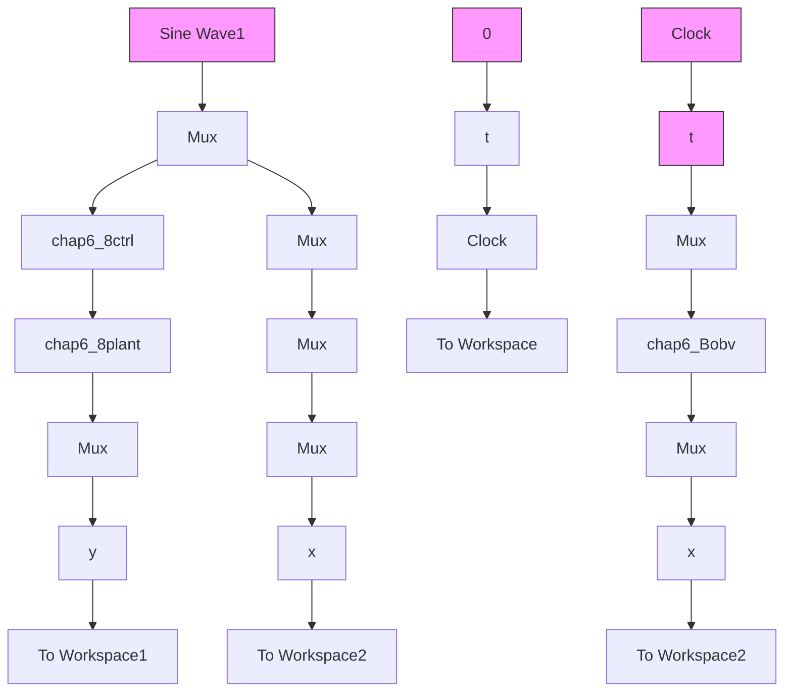

</details>

② 观测器程序：chap6\_8obv.m

```matlab
function [sys,x0,str,ts]=s_function(t,x,u,flag)
switch flag,
case 0,
    [sys,x0,str,ts]=mdlInitializeSizes;
case 1,
    sys=mdlDerivatives(t,x,u);
case 3,
    sys=mdlOutputs(t,x,u);
case {2,4,9}
    sys = [];
otherwise
    error(['Unhandled flag = ',num2str(flag)]);
end
function [sys,x0,str,ts]=mdlInitializeSizes
sizes = simsizes;
sizes.NumContStates = 3;
sizes.NumDiscStates = 0;
sizes.NumOutputs = 3;
sizes.NumInputs = 4;
sizes.DirFeedthrough = 0;
sizes.NumSampleTimes = 0;
sys=simsizes(sizes);
x0=[0 0 0];
str=[];
ts=[];
function sys=mdlDerivatives(t,x,u)
ut=u(1);
th=u(2);
b0=133;

epc0=x(1)-th;
beta1=100;beta2=300;beta3=1000;
delta1=0.0025;delta0=0.01;
delta=10;
alfa1=0.5;alfa2=0.25; 
```

```matlab
if abs(epc0)>delta1
    fal1=abs(epc0)^alfa1*sign(epc0);
else
    fal1=epc0/(delta1^(1-alfa1));
end

if abs(epc0)>delta1
    fal2=abs(epc0)^alfa2*sign(epc0);
else
    fal2=epc0/(delta1^(1-alfa2));
end

sys(1)=x(2)-beta1*epc0;
sys(2)=x(3)-beta2*fal1+b0*ut;
sys(3)=-beta3*fal2;
function sys=mdlOutputs(t,x,u)
fp=x(3);

sys(1)=x(1);
sys(2)=x(2);
sys(3)=fp; 
```

③ 控制器程序：chap6\_8ctrl.m   
```matlab
function [sys,x0,str,ts]=s_function(t,x,u,flag)
switch flag,
case 0,
    [sys,x0,str,ts]=mdlInitializeSizes;
case 1,
    sys=mdlDerivatives(t,x,u);
case 3,
    sys=mdlOutputs(t,x,u);
case {2,4,9}
    sys = [];
otherwise
    error(['Unhandled flag = ',num2str(flag)]);
end
function [sys,x0,str,ts]=mdlInitializeSizes
sizes = simsizes;
sizes.NumContStates = 0;
sizes.NumDiscStates = 0;
sizes.NumOutputs = 1;
sizes.NumInputs = 5;
sizes.DirFeedthrough = 1;
sizes.NumSampleTimes = 0;
sys=simsizes(sizes);
x0=[];
str=[]; 
```

```matlab
ts=[];
function sys=mdlOutputs(t,x,u)
yd=u(1);
dyd=cos(t);
y=u(2);
dy=u(3);
fp=u(5);
