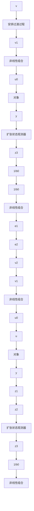

# 6.5.1 自抗扰控制结构

自抗扰控制（Active Disturbance Rejection Control，ADRC）由韩京清教授提出 $^{[2\sim4]}$ ，该控制策略对经典PID控制作了4个方面的改进：①安排过渡过程；②采用跟踪微分器对被控对象提取微分信号；③由非线性扩张观测器实现扰动估计和补偿；④由误差的P、I、D的非线性组合构成非线性PID控制器。

采用微分器实现安排过渡过程，由非线性扩张观测器实现扰动估计和补偿，控制器采用非线性 PID 控制，自抗扰控制系统结构如图 6-16 所示。

flowchart

图 6-16 自抗扰控制系统结构

自抗扰控制策略具体的设计方法如下：采用 6.1 节介绍的非线性跟踪微分器实现安排过渡过程，非线性扩张观测器采用 6.3 节介绍的方法，根据 6.4 节设计非线性 PID 控制器。

