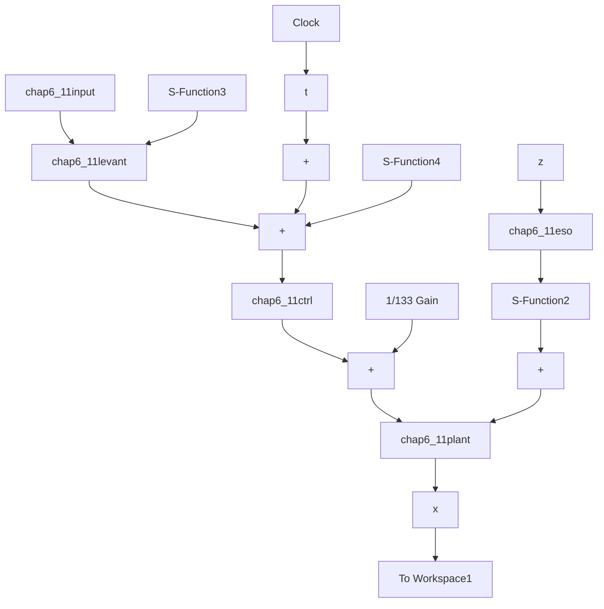

# (1) 连续系统仿真

① Simulink 主程序：chap6\_11sim.mdl


<details>
<summary>flowchart</summary>


</details>

② 方波输入指令 S 函数：chap6\_11input.m

```matlab
function [sys,x0,str,ts] = input(t,x,u,flag)
switch flag,
case 0,
    [sys,x0,str,ts]=mdlInitializeSizes;
case 3,
    sys=mdlOutputs(t,x,u);
case {2,4,9}
    sys=[];
otherwise
    error(['Unhandled flag = ',num2str(flag)]);
end 
```

```matlab
function [sys,x0,str,ts]=mdlInitializeSizes
sizes = simsizes;
sizes.NumOutputs = 1;
sizes.NumInputs = 0;
sizes.DirFeedthrough = 0;
sizes.NumSampleTimes = 0;
sys = simsizes(sizes);
x0 = [];
str = [];
ts = [];
function sys=mdlOutputs(t,x,u)
yd=1.0*sign(sin(t));
sys(1)=yd; 
```

③ 微分器 S 函数：chap6\_11levant.m  
```matlab
function [sys,x0,str,ts] = Differentiator(t,x,u,flag)
switch flag,
case 0,
    [sys,x0,str,ts]=mdlInitializeSizes;
case 1,
    sys=mdlDerivatives(t,x,u);
case 3,
    sys=mdlOutputs(t,x,u);
case {2,4,9}
    sys = [];
otherwise
    error(['Unhandled flag = ',num2str(flag)]);
end
function [sys,x0,str,ts]=mdlInitializeSizes
sizes = simsizes;
sizes.NumContStates = 2;
sizes.NumDiscStates = 0;
sizes.NumOutputs = 2;
sizes.NumInputs = 1;
sizes.DirFeedthrough = 1;
sizes.NumSampleTimes = 1;
sys = simsizes(sizes);
x0 = [0 0];
str = [];
ts = [0 0];
function sys=mdlDerivatives(t,x,u)
vt=u(1);
e=x(1)-vt;
alfa=1;
nmn=5;

sys(1)=x(2)-nmn*(abs(e))^0.5*sign(e);
sys(2)=-alfa*sign(e); 
```

```matlab
function sys=mdlOutputs(t,x,u)
sys = x; 
```
