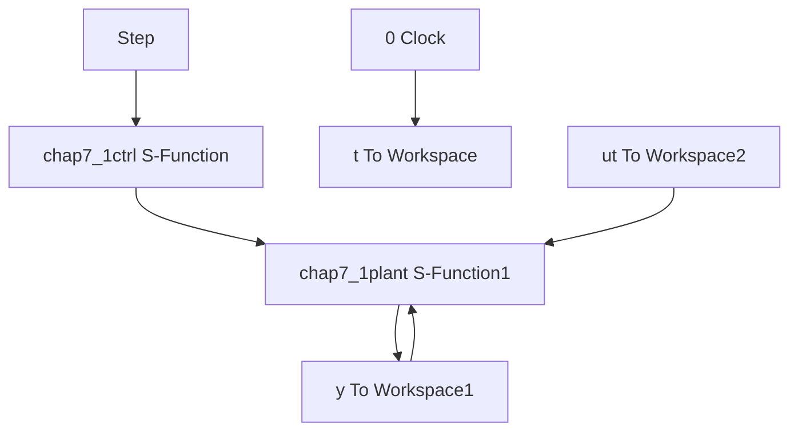

# 〖仿真程序〗

(1) Simulink 主程序: chap7\_1sim.mdl


<details>
<summary>flowchart</summary>


</details>

(2) 控制律程序: chap7\_1ctrl.m  
```matlab
function [sys,x0,str,ts]=s_function(t,x,u,flag)
switch flag,
case 0,
    [sys,x0,str,ts]=mdlInitializeSizes;
case 3,
    sys=mdlOutputs(t,x,u);
case {1,2,4,9}
    sys = [];
otherwise
    error(['Unhandled flag = ',num2str(flag)]);
end
function [sys,x0,str,ts]=mdlInitializeSizes
sizes = simsizes;
sizes.NumContStates = 0;
sizes.NumDiscStates = 0;
sizes.NumOutputs = 1;
sizes.NumInputs = 3;
sizes.DirFeedthrough = 1;
sizes.NumSampleTimes = 1;
sys=simsizes(sizes);
x0=[];
str=[];
ts=[0 0];
function sys=mdlOutputs(t,x,u)
xd=u(1);
dxd=0;ddxd=0;
x1=u(2);
x2=u(3);
e=x1-xd;
de=x2-dxd;

Kp=100;Kd=50;
ut=-Kp*e-Kd*de;

sys(1)=ut; 
```

(3) 被控对象程序: chap7\_1plant.m  
```matlab
function [sys,x0,str,ts]=s_function(t,x,u,flag)
switch flag,
case 0,
    [sys,x0,str,ts]=mdlInitializeSizes;
case 1,
    sys=mdlDerivatives(t,x,u);
case 3,
    sys=mdlOutputs(t,x,u);
case {2,4,9}
    sys = [];
otherwise
    error(['Unhandled flag = ',num2str(flag)]);
end
function [sys,x0,str,ts]=mdlInitializeSizes
sizes = simsizes;
sizes.NumContStates = 2;
sizes.NumDiscStates = 0;
sizes.NumOutputs = 2;
sizes.NumInputs = 1;
sizes.DirFeedthrough = 1;
sizes.NumSampleTimes = 0;
sys=simsizes(sizes);
x0=[0.5;0];
str=[];
ts=[];
function sys=mdlDerivatives(t,x,u)
J=10;C=5;

ut=u(1);

sys(1)=x(2);
sys(2)=1/J*(ut-C*x(2));
function sys=mdlOutputs(t,x,u)
sys(1)=x(1);
sys(2)=x(2); 
```

（4）作图程序：chap7\_1plot.m  
```matlab
close all;
figure(1);
subplot(211);
plot(t,y(:,1),'r',t,y(:,2),'k:','linewidth',2)
xlabel('time(s)');ylabel('Position response');
legend('ideal position signal','position response');
subplot(212);
plot(t,y(:,3),'r','linewidth',2)
xlabel('time(s)');ylabel('Speed response'); 
```

```matlab
figure(2);
plot(t,ut(:,1),'r','linewidth',2)
xlabel('time(s)');ylabel('Control input'); 
```


