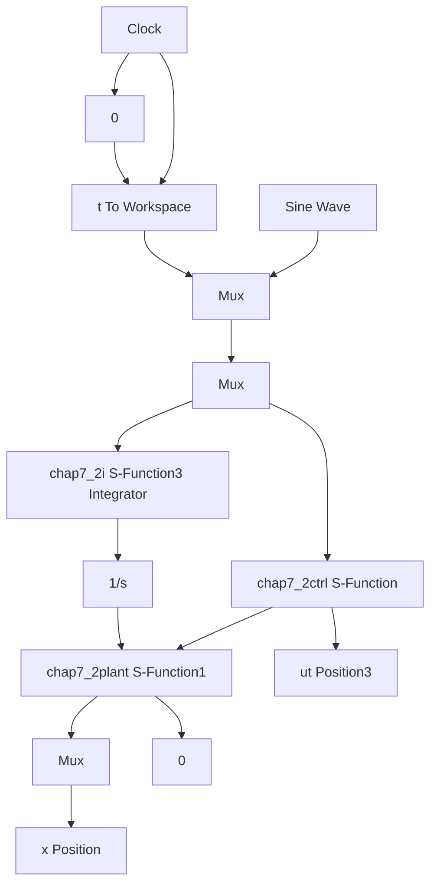

# 〖仿真程序〗

(1) Simulink 主程序: chap7\_2sim.mdl


<details>
<summary>flowchart</summary>


</details>

(2) 控制律程序: chap7\_2ctrl.m

```matlab
function [sys,x0,str,ts]=s_function(t,x,u,flag)
switch flag,
case 0,
    [sys,x0,str,ts]=mdlInitializeSizes;
case 3,
    sys=mdlOutputs(t,x,u);
case {1,2,4,9}
    sys = [];
otherwise
    error(['Unhandled flag = ',num2str(flag)]);
end
function [sys,x0,str,ts]=mdlInitializeSizes
sizes = simsizes; 
```

```matlab
sizes.NumContStates = 0;
sizes.NumDiscStates = 0;
sizes.NumOutputs = 1;
sizes.NumInputs = 4;
sizes.DirFeedthrough = 1;
sizes.NumSampleTimes = 1;
sys=simsizes(sizes);
x0=[];
str=[];
ts=[0 0];
function sys=mdlOutputs(t,x,u)
xd=u(1);
dxd=cos(t);
ddxd=-sin(t);

x1=u(2);
x2=u(3);
e=xd-x1;
de=dxd-x2;

kp=100;ki=30;
c=5.0;
s=c*e+de;
dxr=dxd+c*e;
ddxr=ddxd+c*de;

J=10;C=5;
um=J*ddxr+C*dxr;
kr=30.5;
ur=kr*sign(s);
I=u(4);
ut=um+kp*s+ki*I+ur;

sys(1)=ut; 
```

（3）被控对象程序：chap7\_2plant.m  
```matlab
function [sys,x0,str,ts]=s_function(t,x,u,flag)
switch flag,
case 0,
    [sys,x0,str,ts]=mdlInitializeSizes;
case 1,
    sys=mdlDerivatives(t,x,u);
case 3,
    sys=mdlOutputs(t,x,u);
case {2,4,9}
    sys = [];
otherwise
    error(['Unhandled flag = ',num2str(flag)]);
) 
```

```matlab
end
function [sys,x0,str,ts]=mdlInitializeSizes
sizes = simsizes;
sizes.NumContStates = 2;
sizes.NumDiscStates = 0;
sizes.NumOutputs = 2;
sizes.NumInputs = 1;
sizes.DirFeedthrough = 1;
sizes.NumSampleTimes = 0;
sys=simsizes(sizes);
x0=[0.5;0];
str=[];
ts=[];
function sys=mdlDerivatives(t,x,u)
J=10;C=5;
dt=30*sin(10*t);

ut=u(1);

sys(1)=x(2);
sys(2)=1/J*(ut-C*x(2)-dt);
function sys=mdlOutputs(t,x,u)
sys(1)=x(1);
sys(2)=x(2); 
```
