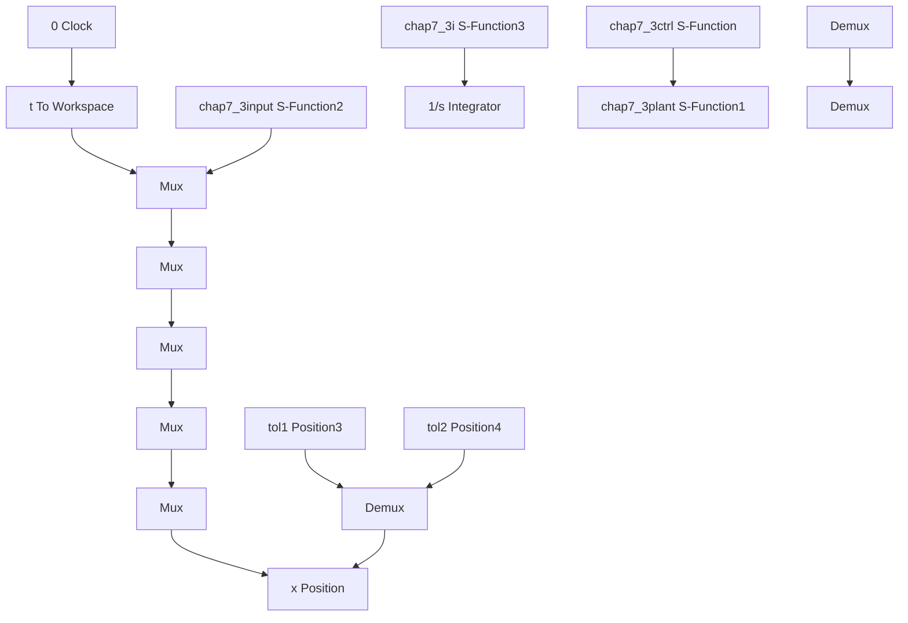

# 〖仿真程序〗

(1) Simulink 主程序: chap7\_3sim.mdl


<details>
<summary>flowchart</summary>


</details>

(2) 位置指令子程序: chap7\_3input.m

```matlab
function [sys,x0,str,ts] = spacemodel(t,x,u,flag)

switch flag,
case 0,
    [sys,x0,str,ts]=mdlInitializeSizes;
case 1,
    sys=mdlDerivatives(t,x,u);
case 3,
    sys=mdlOutputs(t,x,u);
case {2,4,9}
    sys=[];
otherwise
    error(['Unhandled flag = ',num2str(flag)]);
end

function [sys,x0,str,ts]=mdlInitializeSizes
sizes = simsizes;
sizes.NumContStates = 0;
sizes.NumDiscStates = 0;
sizes.NumOutputs = 6;
sizes.NumInputs = 0;
sizes.DirFeedthrough = 0;
sizes.NumSampleTimes = 1;
sys = simsizes(sizes);
x0 = [];
str = [];
ts = [0 0];

function sys=mdlOutputs(t,x,u)
S=2;
if S==1 
```

```matlab
qd0=[0;0];
qdtf=[1;2];
td=1;
if t<1
    qd1=qd0(1)+(-2*t.^3/td^3+3*t.^2/td^2)*(qdtf(1)-qd0(1));
    qd2=qd0(2)+(-2*t.^3/td^3+3*t.^2/td^2)*(qdtf(2)-qd0(2));
    d_qd1=(-6*t.^2/td^3+6*t./td^2)*(qdtf(1)-qd0(1));
    d_qd2=(-6*t.^2/td^3+6*t./td^2)*(qdtf(2)-qd0(2));
    dd_qd1=(-12*t/td^3+6/td^2)*(qdtf(1)-qd0(1));
    dd_qd2=(-12*t/td^3+6/td^2)*(qdtf(2)-qd0(2));
else
    qd1=qdtf(1);
    qd2=qdtf(2);

d_qd1=0;
    d_qd2=0;

dd_qd1=0;
    dd_qd2=0;
end
elseif S==2
    qd1=0.5*sin(pi*t);
    d_qd1=0.5*pi*cos(pi*t);
    dd_qd1=-0.5*pi*pi*sin(pi*t);

qd2=sin(pi*t);
    d_qd2=pi*cos(pi*t);
    dd_qd2=-pi*pi*sin(pi*t);
end

sys(1)=qd1;
sys(2)=d_qd1;
sys(3)=dd_qd1;
sys(4)=qd2;
sys(5)=d_qd2;
sys(6)=dd_qd2; 
```

（3）控制器子程序：chap7\_3ctrl.m  
```matlab
function [sys,x0,str,ts] = spacemodel(t,x,u,flag)
switch flag,
case 0,
    [sys,x0,str,ts]=mdlInitializeSizes;
case 3,
    sys=mdlOutputs(t,x,u);
case {1,2,4,9}
    sys=[];
otherwise
    error(['Unhandled flag = ',num2str(flag)]);
end 
```
