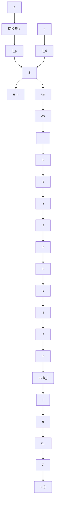

# 7.4.2 基于 Anti-windup 的 PID 控制

文献[2]针对积分 Windup 现象，设计了一种抗饱和的变结构 PID 控制算法，其结构如图 7-8 所示。

flowchart

图 7-8 基于 Anti-windup 的 PID 控制器结构

图 7-8 描述的抗饱和控制思想为：对控制输入饱和误差 $u_{n}-u_{s}$ 进行积分，并通过自适应系数调整将其加到 PID 控制中的积分项中。

抗饱和变结构 PID 控制算法如下：采用系数 $\eta$ 实现积分项的自适应调整，其自适应变化律为：

$$
\dot {\eta} = \left\{ \begin{array}{l l} - \alpha \left(u _ {\mathrm{n}} - u _ {\mathrm{s}}\right) / k _ {\mathrm{i}}, & u _ {\mathrm{n}} \neq u _ {\mathrm{s}}, e \left(u _ {\mathrm{n}} - \bar {u}\right) > 0 \\ e & u _ {\mathrm{n}} = u _ {\mathrm{s}} \end{array} \right. \tag {7.18}
$$

式中， $\overline{u}=(u_{\min}+u_{\max})/2;\quad\alpha>0;\quad u_{\max}$ 和 $u_{\min}$ 为控制输入信号的最大最小值。

基于 Anti-windup 的 PID 控制算法为

$$u (t) = k _ {\mathrm{p}} e (t) + k _ {\mathrm{i}} \eta + k _ {\mathrm{d}} \frac {\mathrm{d} e (t)}{\mathrm{d} t} \tag {7.19}$$

