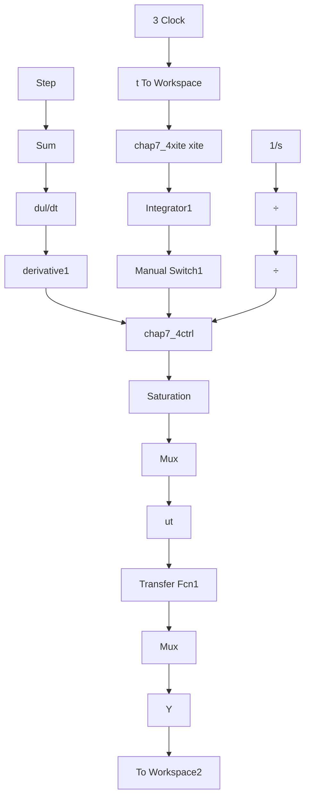

# 〖仿真程序〗

(1) Simulink 主程序: chap7\_4sim.mdl


<details>
<summary>flowchart</summary>


</details>

(2) 控制器 S 函数子程序: chap7\_4ctrl.m  
```matlab
function [sys,x0,str,ts]=s_function(t,x,u,flag)
switch flag,
case 0,
    [sys,x0,str,ts]=mdlInitializeSizes;
case 3,
    sys=mdlOutputs(t,x,u);
case {1,2,4,9}
    sys = [];
otherwise
    error(['Unhandled flag = ',num2str(flag)]);
end
function [sys,x0,str,ts]=mdlInitializeSizes
sizes = simsizes;
sizes.NumContStates = 0;
sizes.NumDiscStates = 0;
sizes.NumOutputs = 1;
sizes.NumInputs = 3;
sizes.DirFeedthrough = 1;
sizes.NumSampleTimes = 0;
sys=simsizes(sizes);
x0=[];
str=[];
ts=[];
function sys=mdlOutputs(t,x,u)
e=u(1);
de=u(2);
ei=u(3);

kp=50;ki=10;kd=1;

ut=kp*e+ki*ei+kd*de; %Without anti-windup
sys(1)=ut; 
```  
（3）自适应调整系数 S 函数子程序：chap7\_4xite.m

```matlab
function [sys,x0,str,ts]=s_function(t,x,u,flag)
switch flag,
case 0,
    [sys,x0,str,ts]=mdlInitializeSizes;
case 1,
    sys=mdlDerivatives(t,x,u);
case 3,
    sys=mdlOutputs(t,x,u);
case {2,4,9}
    sys = [];
otherwise
    error(['Unhandled flag = ',num2str(flag)]);
) 
```

```matlab
end
function [sys,x0,str,ts]=mdlInitializeSizes
sizes = simsizes;
sizes.NumContStates = 1;
sizes.NumDiscStates = 0;
sizes.NumOutputs = 1;
sizes.NumInputs = 3;
sizes.DirFeedthrough = 1;
sizes.NumSampleTimes = 0;
sys=simsizes(sizes);
x0=[0];
str=[];
ts=[];
function sys=mdlDerivatives(t,x,u)
e=u(1);
un=u(2);
us=u(3);

ki=10;
alfa=1.0;

umin=0;umax=10;
ua=(umin+umax)/2;
if un~=us&e*(un-ua)>0
    dxite=-alfa*(un-us)/ki;
else
    dxite=e;
end
sys(1)=dxite;
function sys=mdlOutputs(t,x,u)
sys(1)=x(1); %xite 
```
