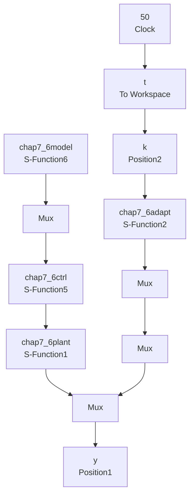

# (1) M 语言仿真

① 主程序：chap7\_5.m

```matlab
%Adaptive Robust Control Based on PD Term
clear all;
close all;
global S

ts=0.001;
TimeSet=[0:ts:60];
b1=20;b2=30;b=50;
Am=[0,1;-b2,-b1];
eig(Am)
Q=[20,10;10,20];

P=lyap(Am',Q);
p12=P(1,2);
p22=P(2,2);
para=[b1,b2,b,p12,p22];

[t,y]=ode45('chap7_5plant',TimeSet,[0.5 0 0 0 0 0 0],[],para);
k0=y(:,5);
k1=y(:,6);
k2=y(:,7);

switch S
case 1
    r=1.0*sign(sin(0.05*t*2*pi)); %Square Signal
case 2 
```

```matlab
r=1.0*sin(1.0*t*2*pi); %Sin Signal
end
u=k0.*r+k1.*y(:,3)+k2.*y(:,4);

figure(1);
subplot(211);
plot(t,y(:,1),'r',t,y(:,3),'k:','linewidth',2);
xlabel('Time(s)');ylabel('Position tracking');
legend('Ideal position signal','Position signal tracking');
subplot(212);
plot(t,y(:,1)-y(:,3),'r','linewidth',2);
xlabel('Time(s)');ylabel('Position tracking error');

figure(2);
plot(t,u,'r','linewidth',2);
xlabel('Time(s)');ylabel('Control input');

figure(3);
subplot(3,1,1);
plot(t,k0,'r','linewidth',2);
xlabel('Time(s)');ylabel('k0');
subplot(3,1,2);
plot(t,k1,'r','linewidth',2);
xlabel('Time(s)');ylabel('k1');
subplot(3,1,3);
plot(t,k2,'r','linewidth',2);
xlabel('Time(s)');ylabel('k2'); 
```

② 被控对象子程序：chap7\_5plant.m  
```matlab
function dy=DynamicModel(t,y,flag,para)
global S
dy=zeros(7,1);

S=1;
switch S
case 1
    r=1.0*sign(sin(0.05*t*2*pi)); %Square Signal
case 2
    r=1.0*sin(1.0*t*2*pi); %Sin Signal
end
p12=para(4);
p22=para(5);

e=y(1)-y(3);
de=y(2)-y(4);
eF=p12*e+p22*de;

k0=y(5);
k1=y(6); 
```

```matlab
k2=y(7);
u=k0*r+k1*y(3)+k2*y(4);

b1=para(1);b2=para(2);b=para(3);
dy(1)=y(2); %Reference Model
dy(2)=b*r-b1*y(2)-b2*y(1);

a1=20;a2=25;a=133;
dy(3)=y(4); %Practical Plant
dy(4)=-a2*y(3)-a1*y(4)+a*u;

dy(5)=200*eF*r; %k0
dy(6)=200*eF*y(3); %k1
dy(7)=200*eF*y(4); %k2 
```

(2) Simulink 仿真程序

① 主程序：chap7\_6sim.mdl


<details>
<summary>flowchart</summary>


</details>

② 参考模型子程序：chap7\_6model.m
