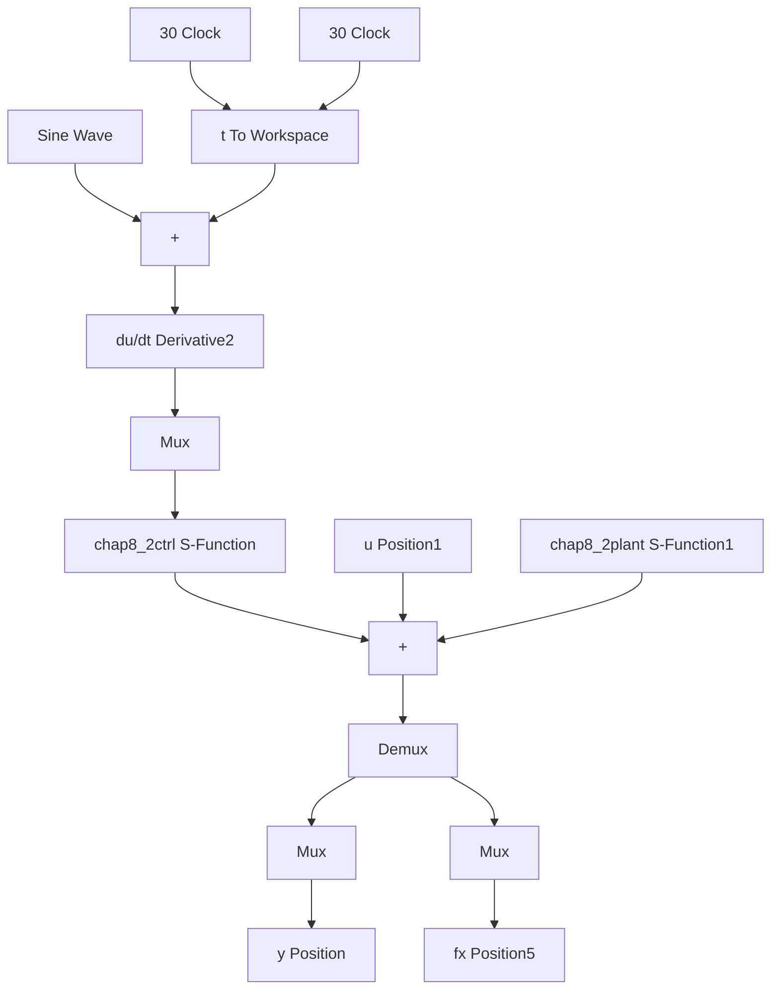

# 〖仿真程序〗

（1）隶属函数设计程序：chap8\_2mf.m

```matlab
clear all;
close all;

L1=-pi/6;
L2=pi/6;
L=L2-L1;

T=L*1/1000;

x=L1:T:L2;
figure(1);
for i=1:1:5
    gs=[(x+pi/6-(i-1)*pi/12)/(pi/24)].^2;
    u=exp(gs);
    hold on;
    plot(x,u);
end

xlabel('x');ylabel('Membership function degree'); 
```

(2) Simulink 主程序: chap8\_2sim.mdl


<details>
<summary>flowchart</summary>


</details>

(3) 控制器 S 函数: chap8\_2ctrl.m

```matlab
function [sys,x0,str,ts] = spacemodel(t,x,u,flag)
switch flag,
case 0,
    [sys,x0,str,ts]=mdlInitializeSizes;
case 1,
    sys=mdlDerivatives(t,x,u);
case 3,
    sys=mdlOutputs(t,x,u);
case {2,4,9}
    sys=[];
otherwise
    error(['Unhandled flag = ',num2str(flag)]);
) 
```

```matlab
end

function [sys,x0,str,ts]=mdlInitializeSizes
sizes = simsizes;
sizes.NumContStates = 25;
sizes.NumDiscStates = 0;
sizes.NumOutputs = 2;
sizes.NumInputs = 2;
sizes.DirFeedthrough = 1;
sizes.NumSampleTimes = 0;
sys = simsizes(sizes);
x0 = [0.1*ones(25,1)];
str = [];
ts = [];
function sys=mdlDerivatives(t,x,u)
gama=100;
xd=0.1*sin(t);
dxd=0.1*cos(t);
ddxd=-0.1*sin(t);

e=u(1);
de=u(2);
x1=xd-e;
x2=de-dxd;

kp=10;
kd=20;
k=[kp;kd];
E=[e,de]';
for i=1:1:25
    thtaf(i,1)=x(i);
end
    %%%%%%%%%%%%%%%%%%%%%%%%%%
A=[0 -kp;
    1 -kd];
Q=[500 0;0 500];
P=lyap(A,Q);
    %%%%%%%%%%%%%%%%%%%%%%%%%
FS1=0;
for l1=1:1:5
    gs1=[(x1+pi/6-(l1-1)*pi/12)/(pi/24)]^2;
    u1(l1)=exp(gs1);
end

for l2=1:1:5
    gs2=[(x2+pi/6-(l2-1)*pi/12)/(pi/24)]^2;
    u2(l2)=exp(gs2);
end 
```

```matlab
for l1=1:1:5
    for l2=1:1:5
    FS2(5*(l1-1)+l2)=u1(l1)*u2(l2);
    FS1=FS1+u1(l1)*u2(l2);
    end
end

FS=FS2/(FS1+0.001);

b=[0;1];
S=-gama*E*P*b*FS;

for i=1:1:25
    sys(i)=S(i);
end

function sys=mdlOutputs(t,x,u)
    xd=0.1*sin(t);
    dxd=0.1*cos(t);
    ddxd=-0.1*sin(t);

e=u(1);
de=u(2);
x1=xd-e;
x2=de-dxd;

kp=10;
kd=20;
k=[kp;kd];
E=[e,de]';
for i=1:1:25
    thtaf(i,1)=x(i);
end

FS1=0;
for l1=1:1:5
    gs1=[(x1+pi/6-(l1-1)*pi/12)/(pi/24)]^2
    u1(l1)=exp(gs1);
end
