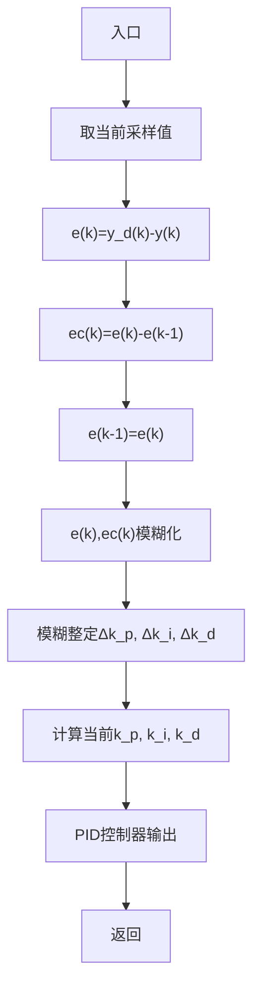

# 8.4.2 仿真实例

被控对象为

$$G _ {\mathrm{p}} (s) = \frac {1 3 3}{s ^ {2} + 2 5 s}$$

flowchart

图 8-10 模糊 PID 工作流程图

采样时间为 1ms，采用 z 变换进行离散化，离散化后的被控对象为：

$$y (k) = - \operatorname{den} (2) y (k - 1) - \operatorname{den} (3) y (k - 2) + \operatorname{num} (2) u (k - 1) + \operatorname{num} (3) u (k - 2)$$

位置指令为幅值为 1.0 的阶跃信号， $y_{\mathrm{d}}(k)=1.0$ 。仿真时，先运行模糊推理系统设计程序 chap8\_4a.m，实现模糊推理系统 fuzzpid.fis，并将此模糊推理系统调入内存中，然后运行模糊控制程序 chap8\_4b.m。在程序 chap8\_4a.m 中，根据模糊规则表 8-3 至表 8-4，分别对 e、ec、 $k_{p}$ 、 $k_{i}$ 进行隶属函数的设计。根据位置指令、初始误差和经验设计 e、ec、 $k_{p}$ 、 $k_{i}$ 的范围。

在 MATLAB 环境下，对模糊系统 a，运行 plotmf 命令，可得到模糊系统 e、ec、 $k_{p}$ 、 $k_{i}$ 的隶属函数，如图 8-11～8-14 所示，运行命令 showrule 可显示模糊规则，可显示 9 条模糊规则，描述如下：

line

| e | Degree of membership |
| --- | --- |
| -1.0 | 1.0 |
| -0.8 | 0.8 |
| -0.6 | 0.4 |
| -0.4 | 0.2 |
| -0.2 | 0.4 |
| 0.0 | 1.0 |
| 0.2 | 0.4 |
| 0.4 | 0.2 |
| 0.6 | 0.4 |
| 0.8 | 0.8 |
| 1.0 | 1.0 |

图8-11 误差的隶属函数

line

| ec | Degree of membership |
| --- | --- |
| -1.0 | 1.0 |
| -0.8 | 0.8 |
| -0.6 | 0.4 |
| -0.4 | 0.2 |
| -0.2 | 0.0 |
| 0.0 | 1.0 |
| 0.2 | 0.8 |
| 0.4 | 0.4 |
| 0.6 | 0.2 |
| 0.8 | 0.0 |
| 1.0 | 1.0 |

图 8-12 误差变化率的隶属函数

line

| kp | Degree of membership |
| --- | --- |
| -3.0 | 1.0 |
| -2.0 | 0.5 |
| -1.0 | 0.0 |
| 0.0 | 1.0 |
| 1.0 | 0.5 |
| 2.0 | 0.0 |
| 3.0 | 1.0 |

图8-13 $k_{\mathrm{p}}$ 的隶属函数

line

| ki | Degree of membership |
| --- | --- |
| -0.1 | 1.0 |
| -0.08 | 0.8 |
| -0.06 | 0.4 |
| -0.04 | 0.2 |
| -0.02 | 0.0 |
| 0.0 | 1.0 |
| 0.02 | 0.8 |
| 0.04 | 0.4 |
| 0.06 | 0.2 |
| 0.08 | 0.4 |
| 0.1 | 1.0 |

图 8-14 $k_{i}$ 的隶属函数
