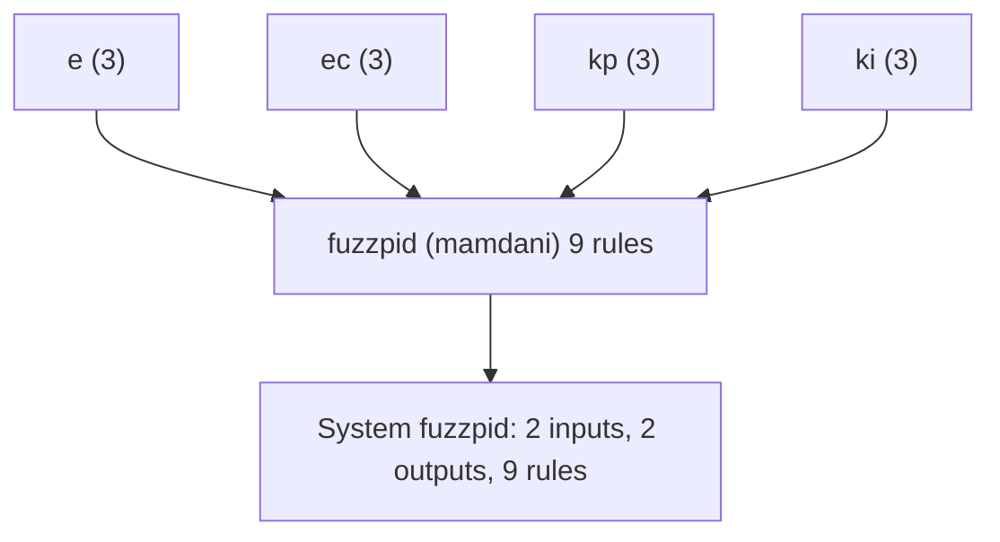

1. If (e is N) and (ec is N) then (kp is N)(ki is Z) (1)   
2. If (e is N) and (ec is Z) then (kp is N)(ki is Z) (1)   
3. If (e is N) and (ec is P) then (kp is N)(ki is Z) (1)   
4. If (e is Z) and (ec is N) then (kp is N)(ki is P) (1)   
5. If (e is Z) and (ec is Z) then (kp is P)(ki is P) (1)   
6. If (e is Z) and (ec is P) then (kp is P)(ki is P) (1)   
7. If (e is P) and (ec is N) then (kp is P)(ki is Z) (1)   
8. If (e is P) and (ec is Z) then (kp is P)(ki is Z) (1)   
9. If (e is P) and (ec is P) then (kp is P)(ki is Z) (1)

另外，针对模糊推理系统 fuzzpid.fis，运行命令 fuzzy 可进行规则库和隶属函数的编辑，如图 8-15 所示；运行命令 ruleview 可实现模糊系统的动态仿真，如图 8-16 所示。

flowchart

图 8-15 模糊系统 fuzzpid.fis 的结构

text_image

Rule Viewer: fuzzpid
File Edit View Options
e = 0
ec = 0
kp = 2.67
ki = 0.0811
Input: [0.0]
Plot points: 101
Move: left right down up
Opened system fuzzpid, 9 rules
Help Close

图 8-16 模糊推理系统的动态仿真环境

在程序 chap8\_4b.m 中，利用所设计的模糊系统 fuzzpid.fis 进行 PI 控制参数的整定。为了显示模糊规则调整效果，取 $k_{p}$ 、 $k_{i}$ 的初始值为零，响应结果及 PI 控制参数的自适应变化

如图 8-17 和图 8-18 所示。

line

| time(s) | ideal position | position tracking |
| --- | --- | --- |
| 0.0 | 1.0 | 0.0 |
| 0.1 | 1.0 | 0.8 |
| 0.2 | 1.0 | 1.05 |
| 0.3 | 1.0 | 1.0 |
| 0.4 | 1.0 | 1.0 |
| 0.5 | 1.0 | 1.0 |
| 0.6 | 1.0 | 1.0 |
| 0.7 | 1.0 | 1.0 |
| 0.8 | 1.0 | 1.0 |
| 0.9 | 1.0 | 1.0 |
| 1.0 | 1.0 | 1.0 |

图 8-17 模糊 PI 控制阶跃响应

line

| time(s) | kp |
| --- | --- |
| 0.0 | 2.65 |
| 0.1 | 2.45 |
| 0.2 | 2.65 |
| 0.3 | 2.65 |
| 0.4 | 2.65 |
| 0.5 | 2.65 |
| 0.6 | 2.65 |
| 0.7 | 2.65 |
| 0.8 | 2.65 |
| 0.9 | 2.65 |
| 1.0 | 2.65 |

line

| time(s) | ξ |
| --- | --- |
| 0.0 | 0.0 |
| 0.1 | 0.08 |
| 0.2 | 0.08 |
| 0.3 | 0.08 |
| 0.4 | 0.08 |
| 0.5 | 0.08 |
| 0.6 | 0.08 |
| 0.7 | 0.08 |
| 0.8 | 0.08 |
| 0.9 | 0.08 |
| 1.0 | 0.08 |

图 8-18 $k_{p}$ 和 $k_{d}$ 的模糊自适应调整
