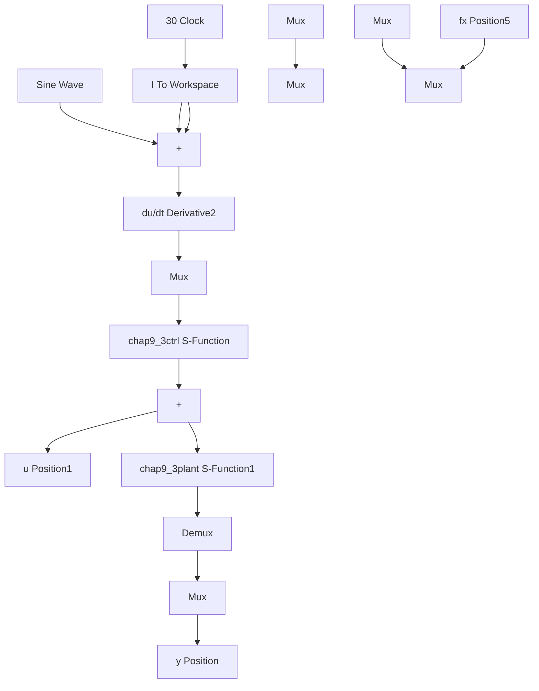

# 〖仿真程序〗

(1) Simulink 主程序: chap9\_3sim.mdl


<details>
<summary>flowchart</summary>


</details>

(2) 控制器 S 函数: chap9\_3ctrl.m

```matlab
function [sys,x0,str,ts] = spacemodel(t,x,u,flag)
switch flag,
case 0,
    [sys,x0,str,ts]=mdlInitializeSizes;
case 1,
    sys=mdlDerivatives(t,x,u);
case 3,
    sys=mdlOutputs(t,x,u);
case {2,4,9}
    sys=[];
otherwise
    error(['Unhandled flag = ',num2str(flag)]);
end
function [sys,x0,str,ts]=mdlInitializeSizes
global c bn
sizes = simsizes;
sizes.NumContStates = 5;
sizes.NumDiscStates = 0;
sizes.NumOutputs = 2;
sizes.NumInputs = 2;
sizes.DirFeedthrough = 1;
sizes.NumSampleTimes = 0;
sys = simsizes(sizes);
x0 = [0*ones(5,1)];
c=[-0.2 -0.1 0 0.1 0.2; -0.2 -0.1 0 0.1 0.2];
bn=0.5*ones(5,1);
str = [];
ts = [];
function sys=mdlDerivatives(t,x,u)
global c bn
gama=30;
yd=0.1*sin(t);
dyd=0.1*cos(t); 
```

```matlab
ddyd=-0.1*sin(t);

e=u(1);
de=u(2);
x1=yd-e;
x2=dyd-de;

k1=50;
k2=30;
k=[k2;k1];
E=[e,de]';
A=[0 -k2;
    1 -k1];
Q=[500 0;0 500];
P=lyap(A,Q);

xi=[e;de];
h=zeros(5,1);
for j=1:1:5
    h(j)=exp(-norm(xi-c(:,j))^2/(2*bn(j)*bn(j)));
end

W=[x(1) x(2) x(3) x(4) x(5)]';
b=[0;1];
S=-gama*E*P*b*h;

for i=1:1:5
    sys(i)=S(i);
end

function sys=mdlOutputs(t,x,u)
global c bn
yd=0.1*sin(t);
dyd=0.1*cos(t);
ddyd=-0.1*sin(t);

e=u(1);
de=u(2);
x1=yd-e;
x2=dyd-de;

k1=50;
k2=30;
k=[k2;k1];
E=[e,de]';
W=[x(1) x(2) x(3) x(4) x(5)]';
xi=[e;de];
h=zeros(5,1); 
```

```matlab
for j=1:1:5
    h(j)=exp(-norm(xi-c(:,j))^2/(2*bn(j)*bn(j)));
end

fxp=W'*h;

%%%%%%%%%
g=9.8;mc=1.0;m=0.1;l=0.5;
S=l*(4/3-m*(cos(x(1)))^2/(mc+m));
gx=cos(x(1))/(mc+m);
gx=gx/S;
%%%%%%%%%%%%%
ut=1/gx*(-fxp+ddyd+k'*E);

sys(1)=ut;
sys(2)=fxp; 
```
