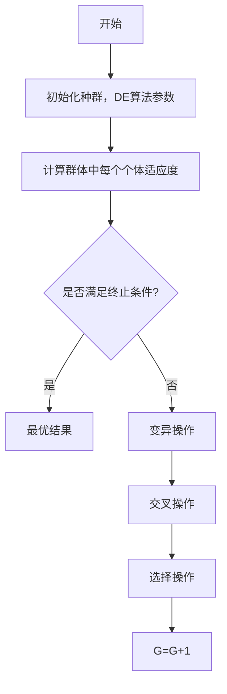

# 1. 变异因子 $F$

变异因子 F 是控制种群多样性和收敛性的重要参数。一般在 $[0,2]$ 之间取值。变异因子 F 值较小时，群体的差异度减小，进化过程不易跳出局部极值导致种群过早收敛。变异因子 F 值较大时，虽然容易跳出局部极值，但是收敛速度会减慢。一般可选在 $F=0.3 \sim 0.6$ 。

flowchart

图 10-1 差分进化基本运算流程

另外，可以采用线性调整变异因子 $F$ ：

$$F = (F _ {\max} - F _ {\min}) \frac {T - t}{T} + F _ {\min}$$

式中，t 为当前进化代数；T 为最大进化代数； $F_{max}$ 和 $F_{min}$ 为选定的变异因子最大和最小值。在算法搜索初期，F 取值较大，有利于扩大搜索空间，保持种群的多样性；在算法后期，收敛的情况下，F 取值较小，有利于在最佳区域的周围进行搜索，从而提高了收敛速率和搜索精度。
