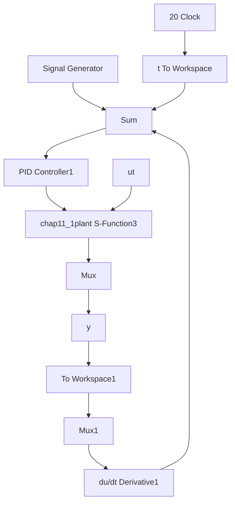

# 〖仿真程序〗

(1) Simulink 主程序: chap11\_1sim.mdl


<details>
<summary>flowchart</summary>


</details>

(2) 被控对象子程序: chap11\_1plant.m

```matlab
function [sys,x0,str,ts]=s_function(t,x,u,flag)
switch flag,
case 0,
    [sys,x0,str,ts]=mdlInitializeSizes;
case 1,
    sys=mdlDerivatives(t,x,u);
case 3,
    sys=mdlOutputs(t,x,u);
case {2,4,9}
    sys = [];
otherwise
    error(['Unhandled flag = ',num2str(flag)]);
end
function [sys,x0,str,ts]=mdlInitializeSizes
sizes = simsizes;
sizes.NumContStates = 3;
sizes.NumDiscStates = 0;
sizes.NumOutputs = 2;
sizes.NumInputs = 1;
sizes.DirFeedthrough = 1;
sizes.NumSampleTimes = 0;
sys=simsizes(sizes);
x0=[0;0;0];
str=[];
ts=[];
function sys=mdlDerivatives(t,x,u)
ut=u(1);

sigma0=260;sigma1=2.5;sigma2=0.02;
Fc=0.28;Fs=0.34; 
```

```matlab
Vs=0.01;
J=1.0;
g=Fc+(Fs-Fc)*exp(-(x(2)/Vs)^2)+sigma2*x(2);
F=sigma0*x(3)+sigma1*x(3)+sigma2*x(2);

sys(1)=x(2);
sys(2)=1/J*(ut-F);
sys(3)=x(2)-(sigma0*abs(x(2))/g)*x(3);
function sys=mdlOutputs(t,x,u)
sys(1)=x(1);
sys(2)=x(2); 
```

(3) 作图子程序: chap11\_1plot.m

```matlab
close all;

figure(1);
subplot(211);
plot(t,y(:,1),'r',t,y(:,3),'k:','linewidth',2);
xlabel('time(s)');ylabel('Position tracking');
legend('ideal position signal','position tracking');
subplot(212);
plot(t,y(:,2),'r',t,y(:,4),'k:','linewidth',2);
xlabel('time(s)');ylabel('Speed tracking');
legend('ideal speed signal','speed tracking');

figure(2);
plot(t,ut(:,1),'r','linewidth',2);
xlabel('time(s)');ylabel('Control input'); 
```


