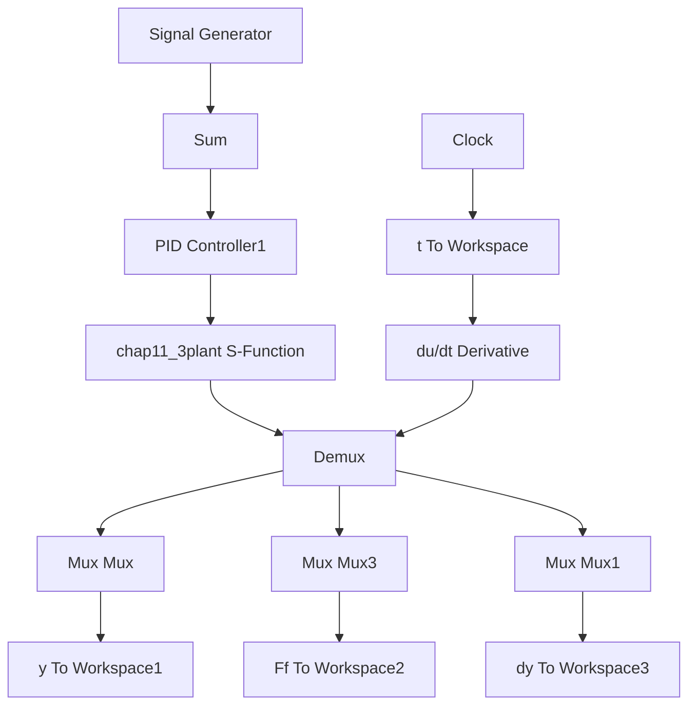

if x(2)>alfa
    Ff=Fc+(Fm-Fc)*exp(-a1*x(2))+kv*x(2);
    dFf=(Fm-Fc)*exp(-a1*x(2))*(-a1)*x(3)+kv*x(3);
elseif x(2)<-alfa
    Ff=-Fc-(Fm-Fc)*exp(a1*x(2))+kv*x(2);
    dFf=(-Fm-Fc)*exp(a1*x(2))*a1*x(3)+kv*x(3);
end

if S==1
    yd=A*sin(w*t);
    dyd=A*w*cos(w*t);
    ddyd=-A*w*w*sin(w*t);
    dddyd=-A*w*w*w*cos(w*t);
end

if S==2
    yd=1;
    dyd=0;
    ddyd=0;
    dddyd=0;
end

if S==3
    yd=A*sign(sin(0.4*2*pi*t));
    dyd=0; 
```

```matlab
ddyd=0;
dddyd=0;
end
error=yd-x(1);
derror=dyd-x(2);
dderror=ddyd-x(3);

u=200*error+40*derror; %PID
du=200*derror+40*dderror;

if u>=110
    u=110;
end
if u<=-110
    u=-110;
end

if M==0
    Ff=0;dFf=0; %No Friction
end
dx(1)=x(2);
dx(2)=-Km*Ce/(J*R)*x(2)+Ku*Km*u/(J*R)-Ff/J;
dx(3)=-Km*Ce/(J*R)*x(3)+Ku*Km*du/(J*R)-dFf/J;
aa=dx(3); 
```

(2) Simulink 仿真

① Simulink 主程序：chap11\_3sim.mdl


<details>
<summary>flowchart</summary>


</details>

② 被控对象 S 函数程序：chap11\_3plant.m

```matlab
function [sys,x0,str,ts] = spacemodel(t,x,u,flag)
switch flag,
case 0,
[sys,x0,str,ts]=mdlInitializeSizes;
case 1, 
```

```matlab
sys=mdlDerivatives(t,x,u);
case 3,
    sys=mdlOutputs(t,x,u);
case {2,4,9}
    sys=[];
otherwise
    error(['Unhandled flag = ',num2str(flag)]);
end

function [sys,x0,str,ts]=mdlInitializeSizes
sizes = simsizes;
sizes.NumContStates = 2;
sizes.NumDiscStates = 0;
sizes.NumOutputs = 3;
sizes.NumInputs = 1;
sizes.DirFeedthrough = 1;
sizes.NumSampleTimes = 1;
sys = simsizes(sizes);
x0 = [0;0];
str = [];
ts = [0 0];
function sys=mdlDerivatives(t,x,u)
%Servo system Parameters
J=0.6;Ce=1.2;Km=6;
Ku=11;R=7.77;
kv=2.0;

alfa=0.01;
a1=1.0; %Effect on the shape of friction curve
Fm=20;
Fc=15;
kv=2.0;
ut=u(1);
F=ut;
if abs(x(2))<=alfa
    if F>Fm
    Ff=Fm;
    elseif F<-Fm
    Ff=-Fm;
    else
    Ff=F;
    end
end
if x(2)>alfa
    Ff=Fc+(Fm-Fc)*exp(-a1*x(2))+kv*x(2);
elseif x(2)<-alfa
    Ff=-Fc-(Fm-Fc)*exp(a1*x(2))+kv*x(2);
end 
```
