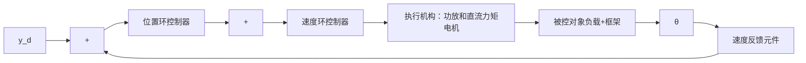
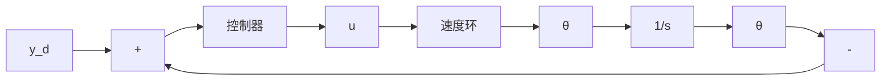
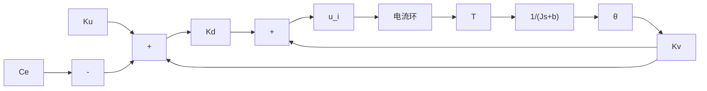
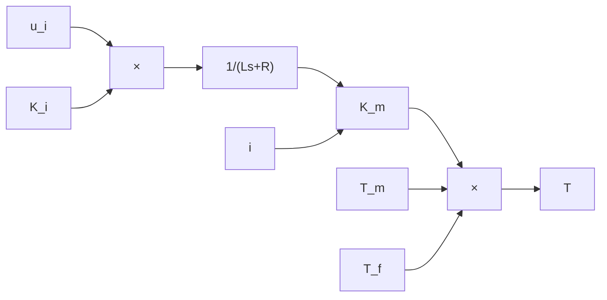

# 11.3.1 伺服系统三环的 PID 控制原理

现代数控机床伺服系统常采用全闭环或半闭环控制系统，而且是三环控制，由里向外分别是电流环、速度环、位置环 $^{[3,4]}$ 。以转台伺服系统为例，其控制结构如图11-7所示，其中 $y_{d}$ 为框架参考角位置输入信号， $\theta$ 为输出角位置信号。伺服系统执行机构为典型的直流电动驱动机构，电机输出轴直接与负载-转动轴相连。为使系统具有较好的速度和加速度性能，引入测速机信号作为系统的速度反馈，直接构成模拟式速度回路。由高精度圆感应同步器与数字变换装置构成数字式角位置伺服回路。

flowchart

图 11-7 转台伺服系统框图

转台伺服系统单框的位置环、速度环和电流环框图如图 11-8、图 11-9 和图 11-10 所示。

flowchart

图 11-8 伺服系统位置环框图

flowchart

图 11-9 伺服系统速度环框图

flowchart

图 11-10 伺服系统电流环框图

以上三图中符号含义如下： $y_{d}$ 为位置指令； $\theta$ 为转台转角； $K_{u}$ 为 PWM 功率放大倍数； $K_{d}$ 为速度环放大倍数； $K_{v}$ 为速度环反馈系数； $K_{i}$ 为电流反馈系数；L 为电枢电感；R 为电枢电阻； $K_{m}$ 为电机力矩系数； $C_{e}$ 为电机反电动势系数；J 为等效到转轴上的转动惯量；b 为黏性阻尼系数，其中 $J = J_{m} + J_{L}$ ， $b = b_{m} + b_{L}$ ， $J_{m}$ 和 $J_{L}$ 分别为电机和负载的转动惯量， $b_{m}$ 和 $b_{L}$ 分别为电机和负载的黏性阻尼系数； $T_{f}$ 为扰动力矩，包括摩擦力矩和耦合力矩，此处 $T_{f} = F_{f}$ 。

假设在速度环中的外加干扰为黏性摩擦模型

$$F _ {\mathrm{f}} (t) = F _ {\mathrm{c}} \cdot \operatorname{sgn} (\dot {\theta}) + b _ {\mathrm{c}} \cdot \dot {\theta} \tag {11.9}$$

控制器采用 PID 控制+前馈控制的形式，加入前馈摩擦补偿控制表示为

$$u _ {\mathrm{f}} (t) = F _ {\mathrm{cl}} \cdot \operatorname{sgn} (\dot {\theta}) + b _ {\mathrm{cl}} \cdot \dot {\theta} \tag {11.10}$$

式中， $F_{c1}$ 和 $b_{c1}$ 为黏性摩擦模型等效到位置环的估计系数，该系数可以根据经验确定，或根据计算得出。

