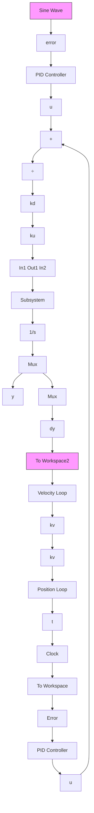
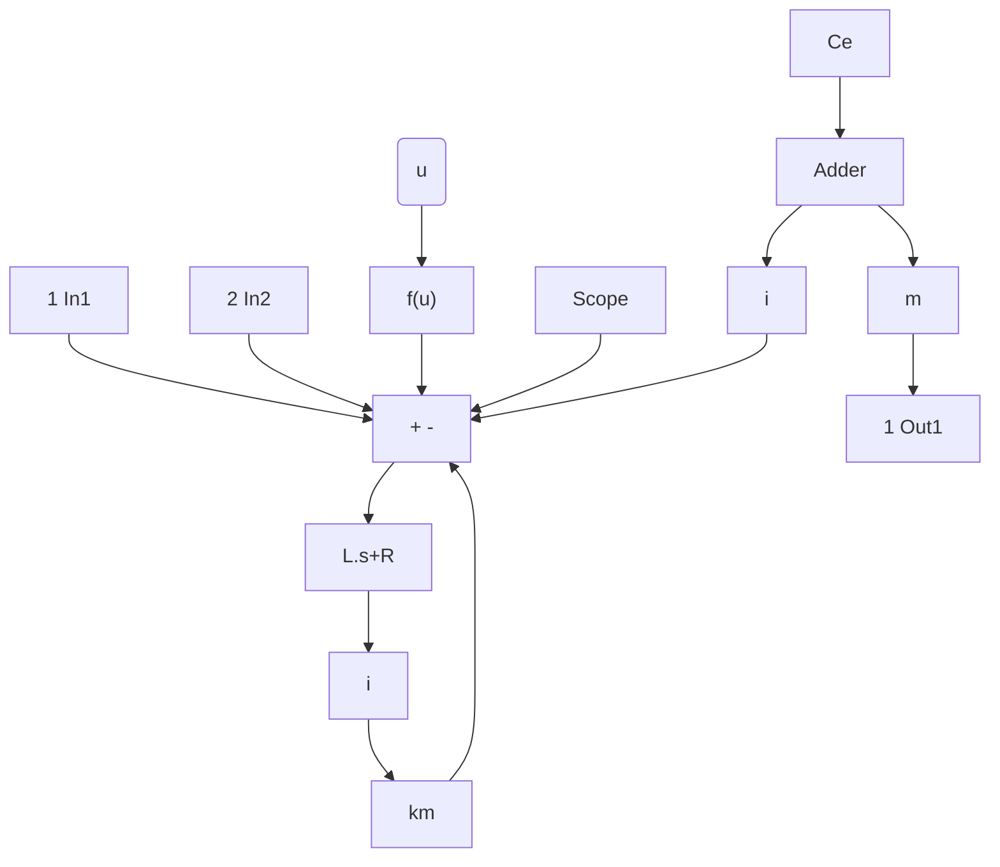

# 〖仿真程序〗

(1) 初始化程序: chap11\_4int.m  
```matlab
%Three Loop of Flight Simulator Servo System with Direct Current Motor
clear all;
close all;
%(1)Current loop
L=0.001; %L<<1 Inductance of motor armature
R=1; %Resistance of motor armature
ki=0.001; %Current feedback coefficient
%(2)Velocity loop
kd=6; %Velocity loop amplifier coefficient
kv=2; %Velocity loop feedback coefficient
J=2; %Equivalent moment of inertia of frame and motor
b=1; %Viscosity damp coefficient of frame and motor
km=1.0; %Motor moment coefficient
Ce=0.001; %Voltage feedback coefficient
%Friction model: Coulomb&Viscous Friction
Fc=100.0;bc=30.0; %Practical friction
%(3)Position loop: PID controller
ku=11; %Voltage amplifier coefficient of PWM
kpp=150;
kii=0.1;
kdd=1.5; 
```

```matlab
%Friction Model compensation
%Equivalent gain from feedforward to practical friction
Gain=ku*Kd*1/R*km*1.0;
Fc1=Fc/Gain; bc1=bc/Gain; %Feedforward compensat 
```

（2）Simulink 主程序：chap11\_4sim.mdl（包括伺服系统位置环模块和伺服系统速度环和电流环模块）


<details>
<summary>flowchart</summary>


</details>

伺服系统位置环模块


<details>
<summary>flowchart</summary>


</details>

伺服系统速度环和电流环模块

（3）作图程序：chap11\_4plot.m

```matlab
close all;
figure(1);
subplot(211);
plot(t,y(:,1),'r',t,y(:,2),'k:','linewidth',2);
xlabel('time(s)');ylabel('Position tracking');
legend('ideal position signal','position tracking');
subplot(212);
plot(t,dy(:,1),'r',t,dy(:,2),'k:','linewidth',2);
xlabel('time(s)');ylabel('Speed tracking');
legend('ideal speed signal','speed tracking'); 
```


