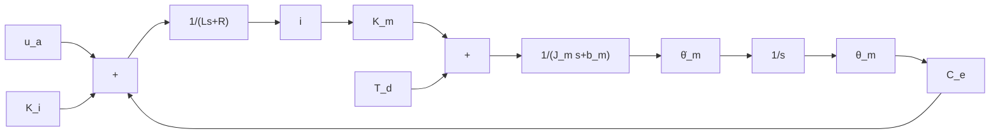

# 11.4.1 二质量伺服系统的 PID 控制原理

如果伺服系统把电机与负载作为一个刚体来考虑，则称为单质量伺服系统，该系统与实际特性有很大差别。对于实际系统，尽管电机与负载是直接耦合的，但传动本质上是弹性的，而且轴承和框架也都不完全是刚性的。在电机驱动力矩的作用下，机械轴会受到某种程度的弯曲和变形。对于加速度要求大、快速性和精度要求高的系统或是转动惯量大、性能要求高的系统，弹性变形对系统性能的影响不能忽略。由于传动轴的弯曲和变形，在传递运动时含有储能元件。如果速度阻尼小，则在它的传递特性中将出现较高的机械谐振，此谐振对系统的动态性能影响较大。因此应将被控对象视为图 11-13 所示由电机、纯惯性负载和联结二者的等效传递轴所组成的三质量系统。

根据图 11-13 可得传动轴动力学方程。根据伺服系统电机框图 11-14 可得电机电力学方程。根据伺服系统负载框图 11-15（不考虑干扰时）可得负载动力学方程。

text_image

+
uₐ
-
ωₘ
Tₘ
θₘ
Jₐ
Kₗ
Tₘₗ
Jₗ
θₗ

图 11-13 电机-传动轴-负载模型

flowchart

图 11-14 伺服系统电机框图

  
图 11-15 负载框图

三质量伺服系统的电学方程和动力学方程：

电机

$$i R + L i = u _ {\mathrm{a}} - C _ {\mathrm{e}} \dot {\theta} _ {\mathrm{m}} - K _ {\mathrm{i}} i \tag {11.11}T _ {\mathrm{m}} = i K _ {\mathrm{m}} \tag {11.12}J _ {\mathrm{m}} \ddot {\theta} _ {\mathrm{m}} = T _ {\mathrm{m}} - b _ {\mathrm{m}} \dot {\theta} _ {\mathrm{m}} - K _ {\mathrm{L}} (\theta_ {\mathrm{m}} - \theta_ {\mathrm{L}}) \tag {11.13}$$

传动轴

$$J _ {\mathrm{a}} (\ddot {\theta} _ {\mathrm{m}} - \ddot {\theta} _ {\mathrm{L}}) = K _ {\mathrm{L}} (\theta_ {\mathrm{m}} - \theta_ {\mathrm{L}}) - T _ {\mathrm{mL}} \tag {11.14}$$

负载

$$J _ {\mathrm{L}} \ddot {\theta} _ {\mathrm{L}} = T _ {\mathrm{mL}} - b _ {\mathrm{L}} \dot {\theta} _ {\mathrm{L}} \tag {11.15}$$

式中， $J_{a}$ 为传动轴的转动惯量； $\theta_{m}$ 和 $\theta_{L}$ 分别为电机和负载的转角； $J_{m}$ 和 $J_{L}$ 分别为电机和负载的转动惯量； $b_{m}$ 和 $b_{L}$ 分别为电机和负载的黏性阻尼系数； $K_{L}$ 为电机和框架之间的耦合刚度系数； $T_{mL}$ 为负载端输出力矩。

一般 $J_{a}$ 相对于 $J_{L}$ 很小，而且其质量分布在轴的长度上，因此可以忽略或计入到 $J_{L}$ 中，

于是上述三质量系统可以简化为二质量系统。二质量系统的电学和动力学方程：

电机 $iR+Li=u_{a}-C_{e}\dot{\theta}_{m}-K_{i}i$ (11.16)
