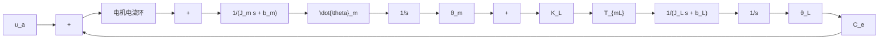

$$T _ {\mathrm{m}} = i K _ {\mathrm{m}} \tag {11.17}J _ {\mathrm{m}} \ddot {\theta} _ {\mathrm{m}} = T _ {\mathrm{m}} - b _ {\mathrm{m}} \dot {\theta} _ {\mathrm{m}} - K _ {\mathrm{L}} (\theta_ {\mathrm{m}} - \theta_ {\mathrm{L}}) \tag {11.18}$$

负载 $J_{L}\ddot{\theta}_{L}=T_{mL}-b_{L}\dot{\theta}_{L}$ (11.19)

$$K _ {\mathrm{L}} (\theta_ {\mathrm{m}} - \theta_ {\mathrm{L}}) - T _ {\mathrm{mL}} = 0 \tag {11.20}$$

根据上述描述，得到二质量伺服系统部分结构图（其余部分与单质量伺服系统结构相同），如图 11-16 所示。

flowchart

图 11-16 二质量伺服系统部分结构框图

