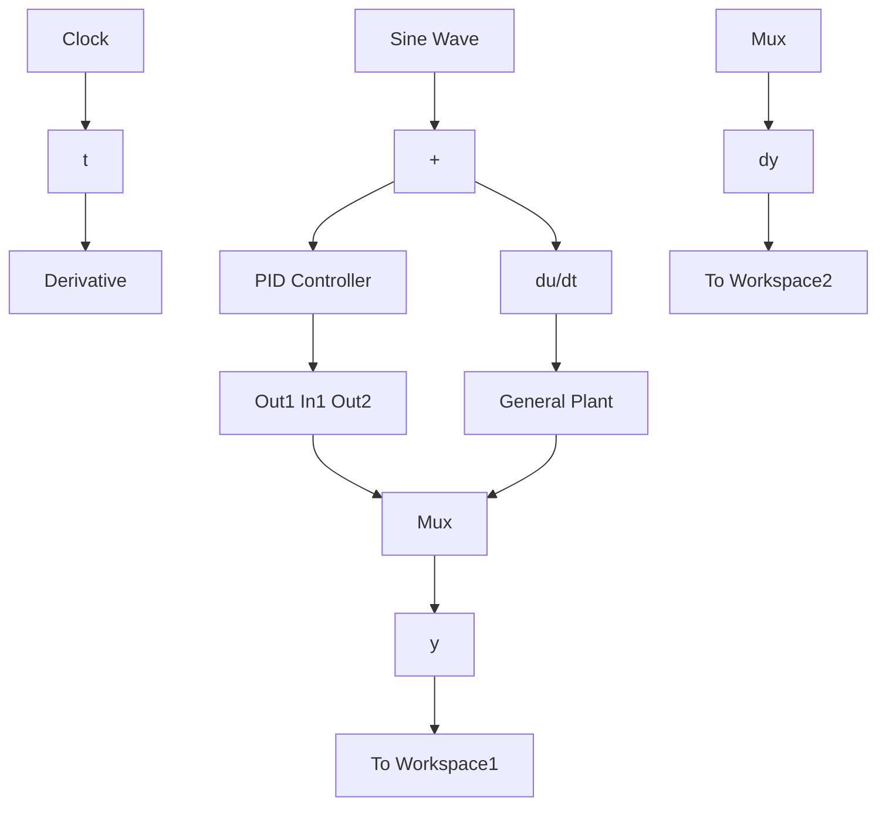
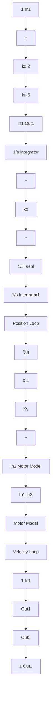

# 〖仿真程序〗

（1）初始化程序：chap11\_5int.m  
```matlab
%Three Loop of Flight Simulator Servo System with two-mass of Direct Current Motor
clear all;
close all;

%(1)Current loop
L=0.001;    %L<<1,Inductance of motor armature
R=1.0;    %Resistance of motor armature
ki=0.001;    %Current feedback coefficient

%(2)Velocity loop
kd=6;    %Velocity loop amplifier coefficient
kv=2;    %Velocity loop feedback coefficient

Jm=0.005;    %Equivalent moment of inertia of motor
bm=0.010;    %Viscosity damp coefficient of motor

km=10;    %Motor moment coefficient
Ce=0.001;    %Voltage feedback coefficient

Jl=0.15;    %Equivalent moment of inertia of frame
bl=8.0;    %Viscosity damp coefficient of frame

kl=5.0;    %Motor moment coefficient between frame and motor

%Friction model: Coulomb&Viscous Friction
Fc=10;bc=3;    %Practical friction 
```

```matlab
%(3)Position loop: PID controller
ku=11; %Voltage amplifier coefficient of PWM
kpp=100;
kii=1.0;
kdd=50; 
```

（2）Simulink 主程序：chap11\_5sim.mdl（包括闭环 PID 控制 Simulink 主模型、二质量伺服系统 Simulink 模型和电机 Simulink 模型）

闭环 PID 控制 Simulink 主模型


<details>
<summary>flowchart</summary>


</details>

二质量伺服系统 Simulink 模型


<details>
<summary>flowchart</summary>


</details>

电机 Simulink 模型


<details>
<summary>flowchart</summary>
