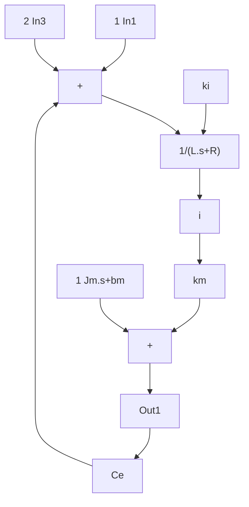

</details>

Direct Current Motor model

（3）作图程序：chap11\_5plot.m

```matlab
close all;
figure(1);
figure(1);
subplot(211);
plot(t,y(:,1),'r',t,y(:,2),'k:','linewidth',2);
xlabel('time(s)');ylabel('Position tracking');
legend('ideal position signal','position tracking');
subplot(212);
plot(t,dy(:,1),'r',t,dy(:,2),'k:','linewidth',2);
xlabel('time(s)');ylabel('Speed tracking');
legend('ideal speed signal','speed tracking'); 
```


