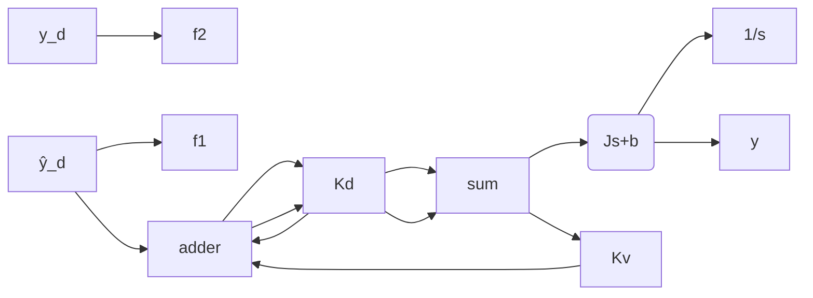

# 11.5.1 伺服系统的模拟 PD+数字前馈控制原理

针对三环伺服系统，设电流环为开环，忽略电机反电动系数，将电阻 R 等效到速度环放大系数 $K_{d}$ 上。简化后的三环伺服系统结构框图如图 11-19 所示，其中 u 为控制输入， $y_{d}$ 为位置指令。

flowchart

图 11-19 简化后的伺服系统框图

采用 PD+前馈控制方式，设计的控制律如下：

$$u = k _ {\mathrm{d}} \left[ k _ {\mathrm{p}} \left(y _ {\mathrm{d}} - \theta\right) - k _ {\mathrm{v}} \dot {\theta} \right] + f _ {1} \dot {y} _ {\mathrm{d}} + f _ {2} \ddot {y} _ {\mathrm{d}} = k _ {1} e - k _ {2} \dot {\theta} + f _ {1} \dot {y} _ {\mathrm{d}} + f _ {2} \ddot {y} _ {\mathrm{d}} \tag {11.21}$$

式中， $k_{1}=k_{d}k_{p}$ ； $k_{2}=k_{d}k_{v}$ ； $e=y_{d}-\theta$ ； $f_{1}$ 和 $f_{2}$ 为前馈系数。

由图 11-19 可知

$$\frac {1}{J s ^ {2} + b s} = \frac {\theta}{u}$$

即

$$J \ddot {\theta} + b \dot {\theta} = u$$

将控制律 $u$ 带入上式，得

$$f _ {1} \dot {y} _ {\mathrm{d}} + f _ {2} \ddot {y} _ {\mathrm{d}} - J \ddot {\theta} - (k _ {2} + b) \dot {\theta} + k _ {1} e = 0$$

取

$$f _ {1} = k _ {2} + b, \quad f _ {2} = J$$

得到系统的误差状态方程如下：

$$J \ddot {e} + (k _ {2} + b) \dot {e} + k _ {1} e = 0$$

由于 J > 0, $k_{2} + b > 0$ , $k_{1} > 0$ ，则根据代数稳定性判据，针对二阶系统而言，当系统闭环特征方程式的系数都大于零时，系统稳定，系统的跟踪误差 $e(t)$ 和 $\dot{e}(t)$ 收敛于零。

