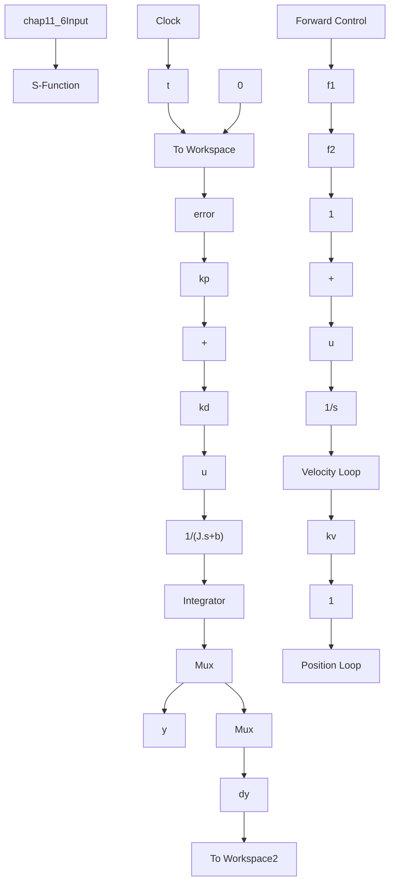

# 〖仿真程序〗

（1）初始化程序：chap11\_6int.m

```matlab
%Flight Simulator Servo System
clear all;
close all;
J=2;
b=0.5;
kv=2;
```

```javascript
kp=15;
kd=6;
f1=(b+kd*kv);
f2=J; 
```

(2) Simulink 主程序: chap11\_6sim.mdl


<details>
<summary>flowchart</summary>


</details>

(3) 作图程序: chap11\_6plot.m

```matlab
close all;
figure(1);
subplot(211);
plot(t,y(:,1),'r',t,y(:,2),'k:','linewidth',2);
xlabel('time(s)');ylabel('Position tracking');
legend('ideal position signal','position tracking');
subplot(212);
plot(t,dy(:,1),'r',t,dy(:,2),'k:','linewidth',2);
xlabel('time(s)');ylabel('Speed tracking');
legend('ideal speed signal','speed tracking'); 
```
