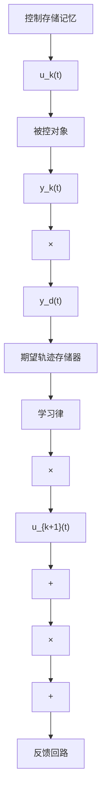

# 12.2 迭代学习控制基本原理

设被控对象的动态过程为

$$\dot {\boldsymbol {x}} (t) = f (\boldsymbol {x} (t), \boldsymbol {u} (t), t), \quad \boldsymbol {y} (t) = g (\boldsymbol {x} (t), \boldsymbol {u} (t), t) \tag {12.1}$$

式中， $x \in R^{n}$ 、 $y \in R^{m}$ 、 $u \in R^{r}$ 分别为系统的状态、输出和输入变量； $f(\cdot)$ 、 $g(\cdot)$ 为适当维数的向量函数，其结构与参数均未知。若期望控制 $u_{\mathrm{d}}(t)$ 存在，则迭代学习控制的目标为：给定期望输出 $y_{\mathrm{d}}(t)$ 和每次运行的初始状态 $x_{k}(0)$ ，要求在给定的时间 $t \in [0, T]$ 内，按照一定的学习控制算法通过多次重复的运行，使控制输入 $u_{k}(t) \to u_{\mathrm{d}}(t)$ ，而系统输出 $y_{k}(t) \to y_{\mathrm{d}}(t)$ 。第 $k$ 次运行时，式（12.1）表示为

$$\dot {\boldsymbol {x}} _ {k} (t) = f (\boldsymbol {x} _ {k} (t), \boldsymbol {u} _ {k} (t), t), \quad \boldsymbol {y} _ {k} (t) = g (\boldsymbol {x} _ {k} (t), \boldsymbol {u} _ {k} (t), t) \tag {12.2}$$

跟踪误差为

$$\boldsymbol {e} _ {k} (t) = \boldsymbol {y} _ {\mathrm{d}} (t) - \boldsymbol {y} _ {k} (t) \tag {12.3}$$

迭代学习控制可分为开环学习和闭环学习。

开环学习控制的方法：第 $k+1$ 次的控制等于第k次控制再加上第k次输出误差的校正项，即

$$\boldsymbol {u} _ {k + 1} (t) = L (\boldsymbol {u} _ {k} (t), \boldsymbol {e} _ {k} (t)) \tag {12.4}$$

闭环学习策略：取第 $k+1$ 次运行的误差作为学习的修正项，即

$$\boldsymbol {u} _ {k + 1} (t) = L (\boldsymbol {u} _ {k} (t), \boldsymbol {e} _ {k + 1} (t)) \tag {12.5}$$

式中， $L$ 为线性或非线性算子。

迭代学习控制的基本结构如图 12-1 所示。

flowchart

图 12-1 迭代学习控制基本结构

