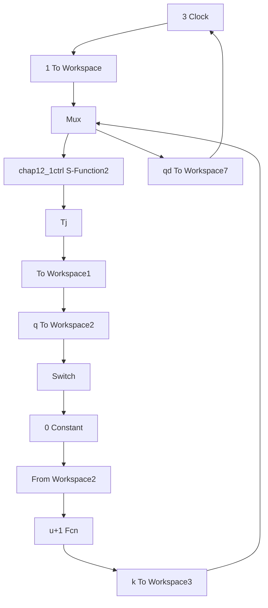

# 〖仿真程序〗

（1）主程序：chap12\_1main.m

```matlab
%PID type Learning Control
clear all;
close all;

t=[0:0.01:3]';
k(1:301)=0; %Total initial points
k=k';
T(1:301)=0;
T=T';
%%%,%,%,%,%,%,%,%,%,%,%,%,%,%,%,%,%,%,%,%%
for i=0:1:20 % Start Learning Control
i
pause(0.01);

sim('chap12_1sim',[0,3]);
q1=q(:,1);
dq1=q(:,2);
qd1=qd(:,1);
dqd1=qd(:,2);

e=qd1-q1;
de=dqd1-dq1;

figure(1);
hold on;
plot(t,qd1,'r',t,q1,'b:','linewidth',2);
xlabel('time(s)');ylabel('Position tracking'); 
```

```matlab
legend('ideal position','position tracking');
j=i+1;
times(j)=i;
ei(j)=max(abs(e));
dei(j)=max(abs(de));
end %End of i
%%%%%%%%%%%%%%%%%%%%%%%%%%%%
figure(2);
subplot(211);
plot(t,qd1,'r',t,q1,'k:','linewidth',2);
xlabel('time(s)');ylabel('Position tracking');
legend('ideal position','position tracking');
subplot(212);
plot(t,dqd1,'r',t,dq1,'k:','linewidth',2);
xlabel('time(s)');ylabel('Speed tracking');
legend('ideal speed','speed tracking');
figure(3);
subplot(211);
plot(times,ei,'*-r','linewidth',2);
title('Change of maximum absolute value of error with times i');
xlabel('times');ylabel('error');
subplot(212);
plot(times,dei,'*-r','linewidth',2);
title('Change of maximum absolute value of derror with times i');
xlabel('times');ylabel('derror'); 
```

(2) Simulink 子程序: chap12\_1sim.mdl


<details>
<summary>flowchart</summary>


</details>

（3）被控对象子程序：chap12\_1plant.m

```matlab
function [sys,x0,str,ts] = spacemodel(t,x,u,flag)
switch flag,
case 0,
[sys,x0,str,ts]=mdlInitializeSizes;
case 1, 
```
