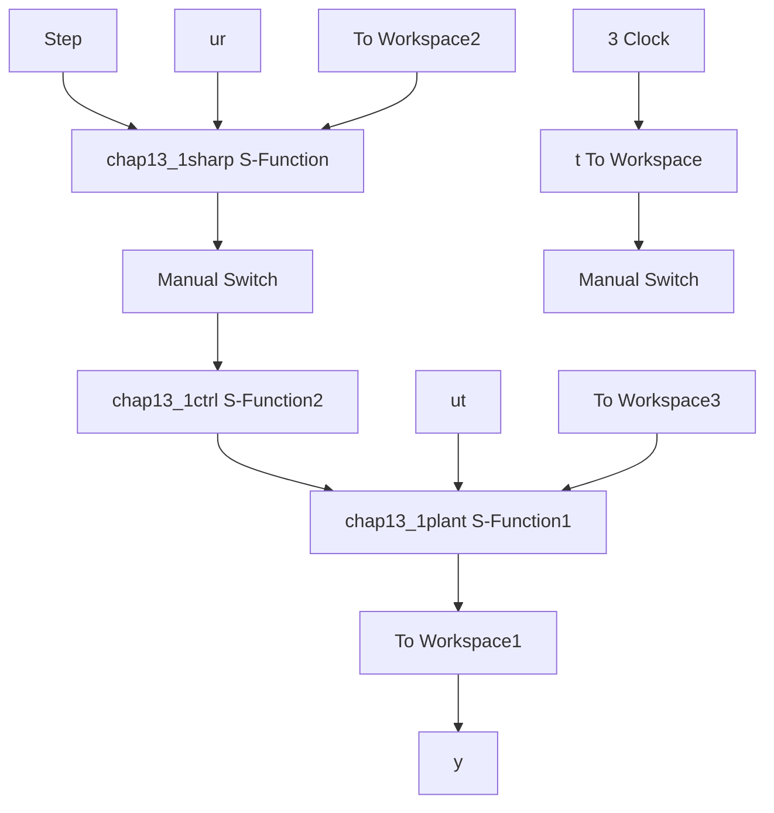

# 〖仿真程序〗

(1) Simulink 主程序: chap13\_1sim.mdl


<details>
<summary>flowchart</summary>


</details>

(2) 输入成型器: chap13\_1sharp.m

```matlab
function [sys,x0,str,ts]=sharper(t,x,u,flag)
switch flag,
case 0,
    [sys,x0,str,ts]=mdlInitializeSizes;
case 3,
sys=mdlOutputs(t,x,u);
case {1,2,4,9}
sys = [];
otherwise
error(['Unhandled flag = ',num2str(flag)]);
end

function [sys,x0,str,ts]=mdlInitializeSizes
sizes = simsizes;
sizes.NumContStates = 0; 
```

```matlab
sizes.NumDiscStates = 0;
sizes.NumOutputs = 1;
sizes.NumInputs = 1;
sizes.DirFeedthrough = 1;
sizes.NumSampleTimes = 1;
sys=simsizes(sizes);
x0=[];
str=[];
ts=[0 0];
function sys=mdlOutputs(t,x,u)
m=4.4;b=18;k=2317;F=27.8;

w=sqrt(k/m);
Ks=b/(2*m*w);
K=exp(-pi*Ks/sqrt(1-Ks^2));

r=u;

A(1)=1/(1+3*K+3*K^2+K^3);
A(2)=3*K/(1+3*K+3*K^2+K^3);
A(3)=3*K^2/(1+3*K+3*K^2+K^3);
A(4)=K^3/(1+3*K+3*K^2+K^3);

fori=1:4
T(i)=(i-1)*pi/(w*sqrt(1-Ks^2)); %T11=0
end
tt=[T(1) T(2) T(3) T(4)];
AA=[A(1) A(2) A(3) A(4)];

fori=2:4
AA(i)=AA(i)+AA(i-1);
end
Amult=AA;

fori=1:4
ur(i)=r*Amult(i);
end
i=find(tt<=t); %1 2 3 4 5 6 7 8
sys=ur(i(end)); 
```

（3）控制器子程序：chap13\_1ctrl.m  
```matlab
function [sys,x0,str,ts]=sharper(t,x,u,flag)
switch flag,
case 0,
[sys,x0,str,ts]=mdlInitializeSizes;
case 3,
sys=mdlOutputs(t,x,u);
case {1,2,4,9}
sys = []; 
```

```matlab
otherwise
error(['Unhandled flag = ',num2str(flag)]);
end

function [sys,x0,str,ts]=mdlInitializeSizes
sizes = simsizes;
sizes.NumContStates = 0;
sizes.NumDiscStates = 0;
sizes.NumOutputs = 1;
sizes.NumInputs = 3;
sizes.DirFeedthrough = 1;
sizes.NumSampleTimes = 1;
sys=simsizes(sizes);
x0=[];
str=[];
ts=[0 0];
function sys=mdlOutputs(t,x,u)
m=4.4;b=18;k=2317;F=27.8;

r=u(1);dr=0;ddr=0;
x1=u(2);
x2=u(3);

e=r-x1;
de=dr-x2;

kp=10000;
kd=1000;
ut=kp*e+kd*de;
sys=ut; 
```
