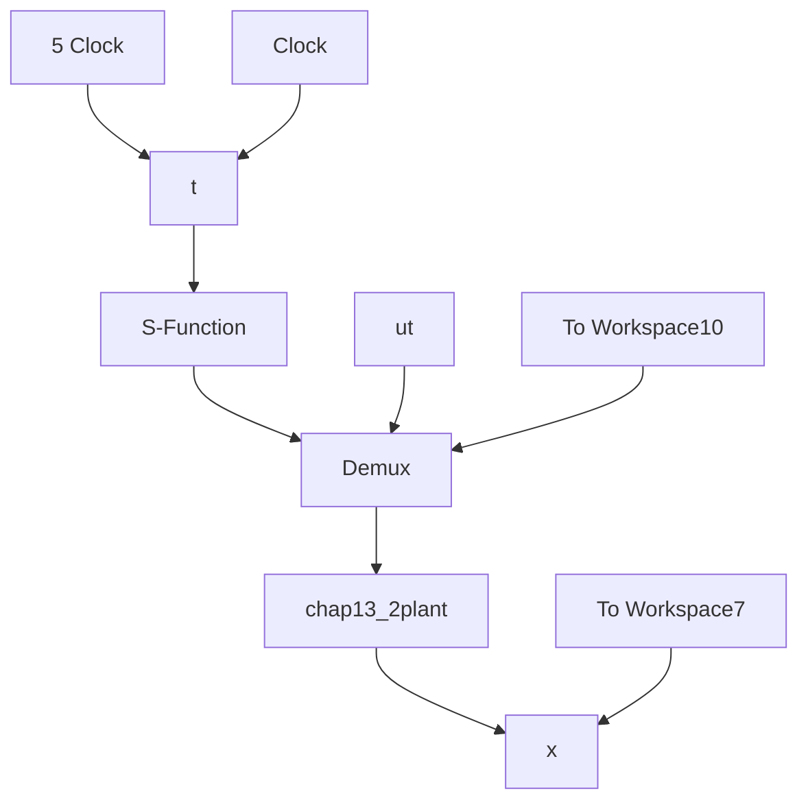

# 〖仿真程序〗

(1) 主程序: chap13\_2sim.mdl


<details>
<summary>flowchart</summary>


</details>

(2) 控制器 S 函数: chap13\_2ctrl.m

```matlab
function [sys,x0,str,ts] = spacemodel(t,x,u,flag)
switch flag,
case 0,
    [sys,x0,str,ts]=mdlInitializeSizes;
case 3,
sys=mdlOutputs(t,x,u);
case {2,4,9}
sys=[];
otherwise
error(['Unhandled flag = ',num2str(flag)]);
end
function [sys,x0,str,ts]=mdlInitializeSizes
sizes = simsizes;
sizes.NumContStates = 0;
sizes.NumDiscStates = 0;
sizes.NumOutputs = 3;
sizes.NumInputs = 2;
sizes.DirFeedthrough = 1;
sizes.NumSampleTimes = 0;
sys = simsizes(sizes);
x0 = [];
str = [];
ts = [];
function sys=mdlOutputs(t,x,u)
x_1=u(1);
z_1=u(2);

kps=10;
us=-1/3*(3*x_1^2+2+kps*x_1);

kpf=1.0;
zs=x_1^2+1+us;
zf=z_1-zs; 
```

```matlab
uf=-kpf*zf;
ut=us+uf;
sys(1)=us;
sys(2)=uf;
sys(3)=ut; 
```

(3) 被控对象 S 函数: chap13\_2plant.m  
```matlab
function [sys,x0,str,ts]=s_function(t,x,u,flag)
switch flag,
case 0,
    [sys,x0,str,ts]=mdlInitializeSizes;
case 1,
sys=mdlDerivatives(t,x,u);
case 3,
sys=mdlOutputs(t,x,u);
case {2,4,9}
sys = [];
otherwise
error(['Unhandled flag = ',num2str(flag)]);
end
function [sys,x0,str,ts]=mdlInitializeSizes
sizes = simsizes;
sizes.NumContStates = 2;
sizes.NumDiscStates = 0;
sizes.NumOutputs = 2;
sizes.NumInputs = 1;
sizes.DirFeedthrough = 0;
sizes.NumSampleTimes = 0;
sys=simsizes(sizes);
x0=[5 0];
str=[];
ts=[];
function sys=mdlDerivatives(t,x,u)
epc=0.001;
ut=u(1);
sys(1)=x(1)^2+2*x(2)+ut;
sys(2)=(x(1)^2-x(2)+1+ut)/epc;
function sys=mdlOutputs(t,x,u)
sys(1)=x(1);
sys(2)=x(2); 
```

(4) 作图程序: chap13\_2plot.m  
```txt
closeall;
figure(1);
plot(t,x(:,1),'k','linewidth',2); 
```

```matlab
xlabel('time(s)');ylabel('x response');
figure(2);
subplot(311);
plot(t,ut(:,1),'k','linewidth',2);
xlabel('time(s)');ylabel('us');
legend('Control input for slow subsystem');
subplot(312);
plot(t,ut(:,2),'k','linewidth',2);
xlabel('time(s)');ylabel('uf');
legend('Control input for fast subsystem');
subplot(313);
plot(t,ut,'k','linewidth',2);
xlabel('time(s)');ylabel('ut');
legend('Total control input'); 
```


