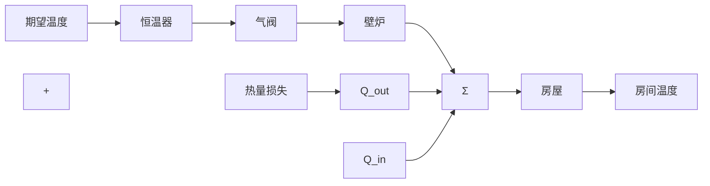

# 1.1 一个简单的反馈系统

反馈系统中的被控变量如温度或速度，通过传感器测量并将测量的信息反馈给控制器去影响这些被控变量。下面用恒温器控制家用壁炉这样一个常见的系统来简单说明这一原理，图1.1显示了系统的组成单元、各部分的连接，以及信息从一个部分到另一个部分的流向。

flowchart

a）房间温度控制系统的组成框图

line

| 时间/h | 房间温度 (T/°F) | 外界温度 (T/°F) |
| --- | --- | --- |
| 0 | 55 | 50 |
| 2 | 55 | 50 |
| 4 | 55 | 50 |
| 6 | 55 | 50 |
| 8 | 65 | 50 |
| 10 | 65 | 50 |
| 12 | 65 | 50 |
| 14 | 65 | 50 |
| 16 | 65 | 50 |

b）房屋温度和壁炉动作曲线  
图1.1 反馈控制

从图 1.1 中，我们很容易分析这个系统的工作过程。当系统工作时，假设恒温器所在房间的温度和外界的温度都明显低于参考温度（也叫设定值），则恒温器就会开始工作，控制逻辑打开气阀，点燃壁炉，此时房屋吸收热量 $Q_{in}$ 的速率明显高于损失热量 $Q_{out}$ 的速率。因此，房间的温度上升，当上升到稍高于恒温器的设定值时，壁炉熄灭，房间的温度开始朝着外界温度值下降。当下降到略低于设定值时，恒温器又开始工作，并且不断重复这个循环。房间温度随着壁炉不断循环开关变化的曲线如图 1.1 所示。外界温度保持在 $50^{\circ}F^{\ominus}$ ，恒温器的初始值设定为 $55^{\circ}F$ ，在上午 6 点时跃变到 $65^{\circ}F$ ，壁炉工作使温度上升到该值，此后温度如图 1.1 所示做周期变化 $^{②}$ 。由于房屋的隔热性良好，所以在图中我们注意到温度随壁炉熄灭下降的速度要比随点燃壁炉而上升的速度慢。从这个例子中，我们可知反馈的基本组成如图 1.2 所示。
