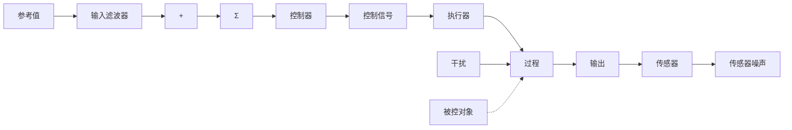

这个反馈系统的核心部分是过程，它的输出就是被控量。在上面的例子中，过程就是房屋，它的输出就是房屋的温度，过程的干扰是通过墙壁、屋顶与较低的外界温度之间的热传导而导致的房屋热量损失 $Q_{out}$ （向外流动的热量也取决于其他因素如风、开门等）。过程的设计对控制的效果有很大影响。比如，一个装有双层隔热玻璃窗的隔热性好的房屋比其他房屋的温度容易控制。同样，想象中的具有控制能力的飞行器的设计与最终实现的性能有着天壤之别。通常，越早把控制问题引入到过程设计中得到的效果越好。执行器就是能够在过程中影响被控变量的装置，在上例中，燃气炉是执行器。实际上，壁炉通常设有喷射打火或点火机构、气阀、鼓风机，它们的开关动作取决于壁炉内的空气温度。这些细节说明了许多反馈系统由各个部分组成，而这些组成部分本身可能是另一个反馈系统 $^{①}$ 。执行器的核心问题是具有以满足要求的速度和范围快速改变过程输出的能力。壁炉必须能够提供比最坏的天气损失的热量更多的热量，而且能够快速散发，以使房屋的温度波动保持在一个小范围内。这时，功率、速度和可靠性比精度更重要。通常，过程与执行器紧密相连，控制设计的核心是要找到一个合适的输入或控制信号发送给执行器。过程和执行器组合在一起的部分称为被控对象，用来准确求解要求的控制信号的装置称为控制器。由于电信号处理的灵活性，虽然基于空气压缩的气压控制器在过程控制中起到重要作用，但控制器主要处理的是电信号。随着数字技术的发展，以及各领域控制器需求的日益增加，高性价比及高灵活性使得数字信号处理器占据主导地位。图1.1中标注的恒温器用来测量房间的温度，在图1.2中称为传感器，它的输出不可避免地含有传感器噪声。传感器的选择和布局在控制设计中非常重要，因为有时候被控量的真实值和测量值不可能完全相同。例如，虽然我们希望控制房屋的整体温度，但恒温器安放在一个特定的房间，这就有可能与其他房间的温度不同。例如，恒温器被设置为68°F，但是被放在附近有壁炉的客厅里时，正在其他地方学习的人可能还会感觉到冷 $^{②③}$ 。正如我们看到的，除了布局之外，传感器重要的特性还包括测量的精度、低噪声、可靠性以及线性性能等。传感器通常将物理变量转变成电信号后输入给控制器处理。一般的系统还包括一个输入滤波器，它的作用是将参考信号转变成电信号后再由控制器处理，在某些情况下，输入滤波器可以修改参考指令输入以改善系统响应。最后，系统中还有一个控制器，通过计算参考信号和传感器输出之间的差值，将系统误差输入给控制器。墙上的恒温器包括传感器、输入滤波器和控制器。几十年前，用户通过手动设置恒温器来保持房间温度。在过去的几十年间，加入微型计算机的恒温器能够存储超过一天、一周甚至更久的期望温度，恒温器获得了学习能力，能够知道期望的温度是多少，并且在某种程度上根据是否有人快要到家来设定温度 $^{①}$ ！

flowchart

图 1.2 基本反馈控制的组成框图

本书将给出分析反馈控制系统的方法，并阐述重要的设计技术。工程师们在应用反馈解决控制问题时，能够利用这些方法。我们也将研究反馈在补偿额外复杂性方面所特有的优点。
