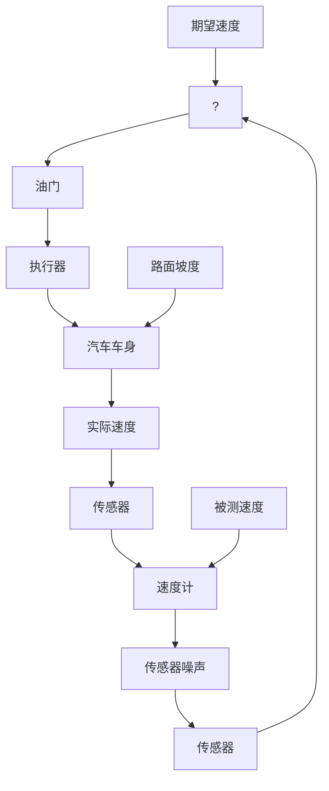
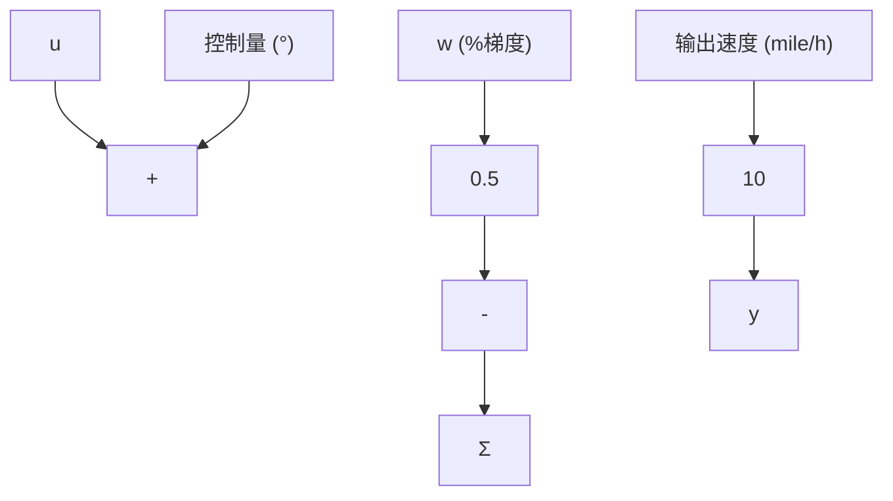
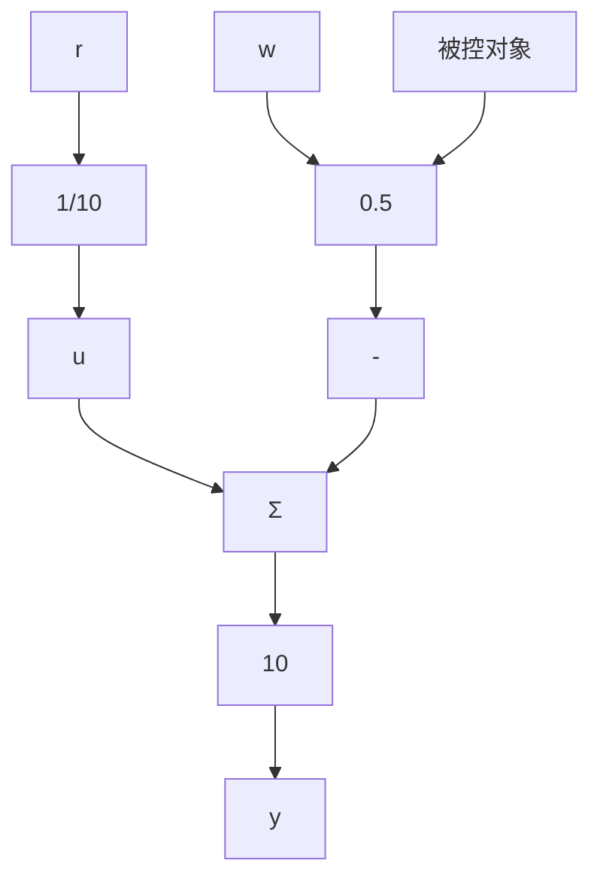

# 1.2 反馈控制的初步分析

通过定量分析汽车巡航控制(见图1.3)这一熟悉系统的简化模型，来论证反馈控制的优点。为了分析这个例子，我们需要建立系统的数学模型，即各变量之间的定量关系形式。在这个例子中，忽略汽车的动态响应，只考虑稳态行为(在后续的章节里将重点讨论动态特性)。并且，假设在系统的速度范围内，各参数间的关系可近似成线性关系。在测得汽车在水平路面上行驶的速度为65mile/h(英里/小时，1mile/h=1.609344km/h)，且油门角度(控制变量u)每改变 $1^{\circ}$ 后，就会使速度(输出变量y)改变10mile/h，因此图1.4所示位于u和y之间为数值10即被控对象的框图。通常，框图是用图形来显示系统的数学关系。通过观察汽车的上下坡运动，发现当坡度变化1%时，速度变化为5mile/h，因此在图1.4上端框中的数值0.5反映了坡度变化1%产生的效果是油门角度变化 $1^{\circ}$ 所产生效果的一半。速度计可精确到0.1mile/h，则认为它是精确的。在框图中，连接线代表传输信号，方框类似一个理想放大器，框中数值乘以输入信号就能得到其输出信号。对于两个或两个以上信号的求和，则把这些信号线同时指向一个求和器，求和器用中间带有求和符号 $\Sigma$ 的圆圈表示，箭头边标注的代数符号(加或减)表示总的输出是加上或者减去这个输入信号。根据这些分析，当参考速度设定为65mile/h时，比较1%的坡度变化在有无反馈给控制器的两种情况下对输出速度的影响。

flowchart

图1.3 汽车巡航控制框图

首先讨论第一种情况，如图1.5所示，控制器没有使用速度计的读数而是设置为 $u = r / 10$ ，其中， $r = 65\mathrm{mile / h}$ 为参考速度，这是一个开环控制系统的例子。开环就是指在框图中没有信号环绕的封闭路径或回路，也就是说，控制变量 $u$ 与输出变量 $y$ 无关。在这个简单的例子中，开环输出速度 $y_{\mathrm{ol}}$ 为

flowchart

图1.4 巡航控制被控对象框图

$$
\begin{array}{l} y _ {\mathrm{ol}} = 1 0 (u - 0. 5 w) \\ = 1 0 \left(\frac {r}{1 0} - 0. 5 w\right) \\ = r - 5 w \\ \end{array}
$$

速度输出误差为

$$e _ {\mathrm{ol}} = r - y _ {\mathrm{ol}} \tag {1.1}= 5 w \tag {1.2}$$

百分比误差为

误差百分比 = 500 $\frac{w}{r}$ (1.3)

如果 r=65mile/h 且路面是水平的，那么 w=0，且速度就为 65mile/h，即没有误差。然而，如果 w=1，相当于存在 1% 的坡度，则速度为 60mile/h，且存在 5mile/h 的误差，此

flowchart

图 1.5 开环巡航控制
