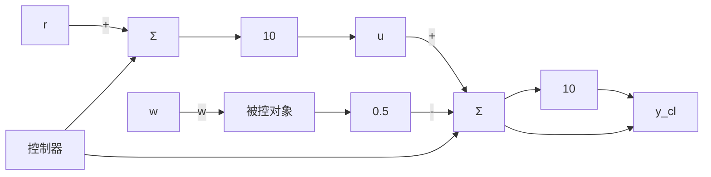

时速度百分比误差为 7.69%。当坡度为 2% 时，速度误差为 10 mile/h，百分比误差为 15.38%，以此类推。这个例子表明当 w=0 时没有误差，但是这样的结果取决于控制器增益是被控对象增益的 1/10。实际上，被控对象的增益是变化的，并且如果它变化，误差便会随即产生。在开环控制中，如果被控对象增益存在误差，则速度百分比误差就会等于被控对象增益百分比误差。

反馈设计框图如图 1.6 所示，其中控制器的增益设为 10。在这个简单的例子中，假设有一个理想的传感器提供的测量值为 $y_{cl}$ ，此时的方程如下：

$$y _ {\mathrm{cl}} = 1 0 u - 5 wu = 1 0 (r - y _ {\mathrm{cl}})$$

flowchart

图 1.6 闭环巡航控制

合并得：

$$y _ {\mathrm{cl}} = 1 0 0 r - 1 0 0 y _ {\mathrm{cl}} - 5 w1 0 1 y _ {\mathrm{cl}} = 1 0 0 r - 5 wy _ {\mathrm{cl}} = \frac {1 0 0}{1 0 1} r - \frac {5}{1 0 1} we _ {\mathrm{cl}} = \frac {r}{1 0 1} + \frac {5 w}{1 0 1}$$

由此可见，与开环系统相比，反馈降低了速度误差对坡度的灵敏性，是开环系统的 $\frac{1}{101}$ 。然而，值得注意的是在水平地面上也会产生一个小的速度误差，因为，即使当w=0时，

$$y _ {\mathrm{cl}} = \frac {1 0 0}{1 0 1} r = 0. 9 9 r$$

只要回路增益(被控对象与控制器增益的乘积)足够大，这个误差就会很小 $^{①}$ 。如果速度参考值为65mile/h，与1%的坡度比较，则输出速度百分比误差为

误差百分比 = 100 $\frac{\frac{65 \times 100}{101} - \left(\frac{65 \times 100}{101} - \frac{5}{101}\right)}{\frac{65 \times 100}{101}}$ (1.4)

$$= 1 0 0 \frac {5 \times 1 0 1}{1 0 1 \times 6 5 \times 1 0 0} \tag {1.5}= 0.0769 \% \tag{1.6}$$

在反馈的情况下，速度对坡度干扰和被控对象增益的灵敏性之所以减少，是由于回路增益为100。但遗憾的是，此增益不能无限增大；当引入动态时，反馈系统的响应会比以前更差，甚至导致系统不稳定。下面通过另一个熟悉且容易改变反馈增益的例子来说明这种情况。若把一个扩音器增益设置得很高，就会发出令人厌烦的尖细的声音，这是由于从演讲者到传声器经放大器再反馈到演讲者这一反馈增益太大所引起的。在不使系统失稳的情况下，如何获得尽可能大的增益，以减小误差是反馈控制设计的关键问题。
