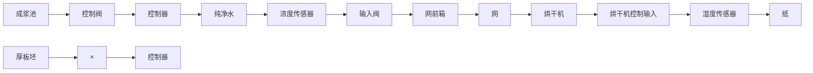

# 习题

1.1 画出下列反馈控制系统的组成框图。

(a) 汽车手动操作系统；  
(b) 德雷贝尔孵化器；  
(c) 浮阀水位控制系统；  
(d) 带飞球调速器的瓦特蒸汽机。

在每一个系统中，标明下列部件的位置，并指出与每个信号相关的装置。

- 被控过程；  
- 过程期望的输出信号；  
- 传感器；  
- 执行器；  
- 执行器输出信号；  
- 控制器；  
- 控制器输出信号；  
- 参考信号；  
- 误差信号。

注意，在大多数情况下，同样的物理设备可能实现不同的功能。

1.2 了解你家里或办公室的恒温器的物理原理，并描述它是如何工作的。  
1.3 造纸机如图 1.12 所示。在这个反馈控制中有两个主要的参数：一个是由厚板坯浓度控制的纤维密度，厚板坯由板材前箱流到板材上；另一个是烘干机输出的最终成品的湿度，成浆池中的原料通过线材下面的

出现前主要的控制设计方法，而现代控制方法始于20世纪60年代，它是基于状态形式的常微分方程(ODE)的控制方法。这两类控制方法有许多联系，有经验的工程师必须同时掌握这两种方法。

输出。

1.7 哪些物理量可以通过测速器测量？  
1.8 给出测量温度的三种不同的方法。  
1.9 为什么不管被测变量的物理属性如何，大多数传感器都有一个电信号输出？

纯净水来稀释，且由控制阀（CV）来控制。用测量仪表来读取浓度值，在机器烘干末端有一个湿度传感器。画出下列两种情况下系统的框图，并注明习题1.1(d)所列的9个部件。

(a) 浓度控制； (b) 湿度控制。

1.4 人体中的许多变量是根据反馈控制的。画出下列被控变量的框图，标出被控的过程、测量变量的传感器、调节变量增加或减小的执行器、完成反馈路径的信息流向，以及干扰变量的扰动。有关这个问题的知识，需要查阅百科全书和关于人体生理学的教材。

(a) 血压；  
(b) 血糖浓度；  
(c) 心率；  
(d) 眼睛视角；   
(e) 瞳孔直径。

1.5 画出冰箱或汽车空调系统中温度控制的组成框图。  
1.6 画出电梯位置控制的组成框图。说明如何测量电梯厢的位置。考虑一个粗略和精度结合的测量系统，你建议每一个传感器的精度应为多少？你所设计的系统应能够校正高层建筑中，存在的驾驶室荷载作用导致电缆明显伸缩的情况。

flowchart

图 1.12 造纸机

1.7 反馈控制要求能测量被控变量，因为电信号可传输、放大且易处理，通常我们希望传感器输出一个与被控变量成比例的电压或电流信号。描述一个传感器，使其输出与下列物理量成比例的输出电信号。

(a) 温度；  
(b) 压力；  
(c) 液位；  
(d) 管道中液体(或动脉中血液)的流量；   
(e) 线位移；  
(f) 角位移；  
(g) 线速度；  
(h) 转速；  
(i) 平移加速度；  
(j) 力矩。

1.8 习题 1.7 中所列举的每一个变量都可以利用反馈控制。描述一个执行器，要求能够接收一个电信号输入来控制所列的变量。指出执行器输出信号的单元。

1.9 生物学中的反馈，也有正反馈和负反馈

(a) 生物学中的负反馈：当一个人处于长期的压力中（如考试前几周）时，下丘脑（大脑中的）分泌一种激素——促肾上腺皮质激素释放因子（CRF），它与脑垂体中的受体相结合后刺激脑垂体产生促肾上腺皮质激素（ACTH），而促肾上腺皮质激素又会反过来刺激肾上腺皮质（肾上腺外层部分）释放压力激素——糖皮质激素（GC）。负反馈作用会通过血液反过来关闭 CRF 和 ACTH 的产生（关闭压力反应）直到 GC 恢复到正常水平。画出这个闭环系统的框图。  
(b) 生物学中的正反馈：这会发生在一些特殊的情况下。考虑一个分娩过程，婴儿借助产道施加的压力通过分泌催产素引起子宫收缩，而分泌催产素会引起更大的压力，这反过来又加剧子宫收缩。孩子出生后，系统又会恢复正常（即负反馈情况）。画出这个闭环系统的框图。
