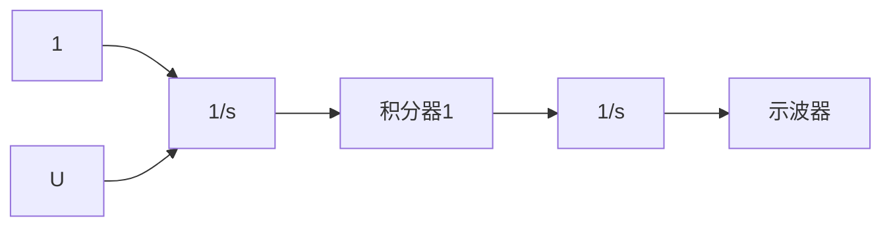

# 例 2.3 旋转运动：卫星姿态控制模型

如图 2.7 所示的卫星，通常要求进行姿态控制，以使天线、传感器和太阳能面板能够准确定位。天线通常指向地球的某一特定位置，而太阳能面板需定位在可获得最大太阳能的方向。为了全部确定出三条轴的姿态控制系统，每次仅考虑其中一条轴是必要的。写出此系统中的一条轴的运动方程，并观察如何在框图中描述它们。另外，确定系统的传递函数并通过 Matlab/Simulink 构建该系统。

解答。本例如图2.8所示，这里仅考虑围绕垂直于纸面的轴的运动，角 $\theta$ 是卫星的定位位置角，是相对于惯性参考系（无角加速度的参考系）的测量值。喷射流产生控制力，相对质心的力矩大小为 $F_{\mathrm{c}}d$ ，同时存在很小的干扰力矩 $M_{\mathrm{D}}$ ，主要是由于太阳压强对太阳能面板的作用不对称而引起的。利用式(2.14)得运动方程为

$$F _ {\mathrm{c}} d + M _ {\mathrm{D}} = I \ddot {\theta} \tag {2.15}$$

系统的输出 $\theta$ 是输入力矩总和的两次积分；因此，这类系统通常称为双积分器被控对象。根据式(2.7)的形式，可得传递函数为

$$\frac {\Theta (s)}{U (s)} = \frac {1}{I} \frac {1}{s ^ {2}} \tag {2.16}$$

natural_image

Illustration of a satellite with propeller and solar panels (no text or symbols)

图 2.7 通信卫星图

text_image

M_D
d
θ
θ̅
喷射流
F_c
惯性参考系

图 2.8 卫星控制简图  
(图片来源：Space Systems/Loral(SSL))

32

其中： $U=F_{c}d+M_{D}$ 。这种形式的系统通常是指 $1/s^{2}$ 被控对象。

图 2.9 所示的左、右两半部分框图用于表示式(2.15)和式(2.16)。这一简单的系统可以使用后面章节所描述的线性分析技术，或者如例 2.1 所示借助 Matlab 软件来分析，也可以利用 Matlab 的子软件包 Simulink 对任意的时间序列进行数值评价，它提供与 Matlab 的无缝连接，可以进行非线性仿真，并且提供图形用户界面的拖曳操作。图 2.10 所示的是用 Simulink 来描述的系统框图。

flowchart

图 2.9 左半部分是式(2.15)的框图，右半部分是式(2.16)的框图

flowchart

图 2.10 双积分器被控对象的 Simulink 框图

还有许多诸如图 2.11 所示的磁盘驱动读/写磁头系统，事实上都具有柔性，可能会在控制系统设计中引发问题。存在柔性，就会产生特殊的难题，如本例中传感器和执行机构位置之间存在柔性。因此，即便是看似相当刚性的系统，模型中考虑柔性通常也是重要的。
