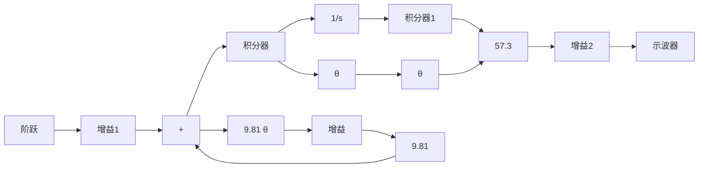
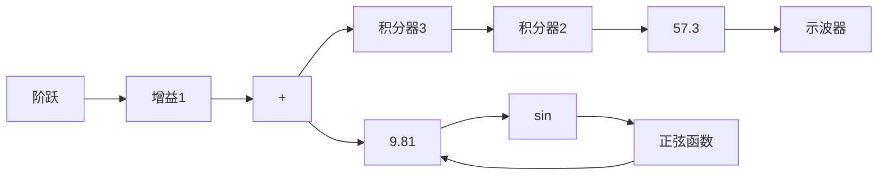

flowchart

图 2.16 线性方程(2.26)的 Simulink 框图

运行数值仿真的结果与图2.15所示的线性结果是完全相同的，因为这里取相对较小的角度，即 $\sin \theta \approx \theta$ 。然而，在求解响应时Simulink能够模拟非线性方程，使得在大范围下均可使用它来分析系统的运动。此时，式(2.26)变成

$$\ddot {\theta} = - 9. 8 1 \sin \theta + 1 \tag {2.27}$$

图 2.17 所示的 Simulink 框图实现了这一非线性方程。

flowchart

图 2.17 非线性方程(2.27)的 Simulink 框图

通常，Simulink 可以仿真所有遇到的非线性问题，包括死区特性、开关函数、粘滞作用、磁滞现象、空气动力阻力 $v^{2}$ 的函数)和三角函数等。所有实际系统都会在不同程度上表现出一个或多个非线性特性。这些非线性问题将会在第 9 章做详细的介绍。
