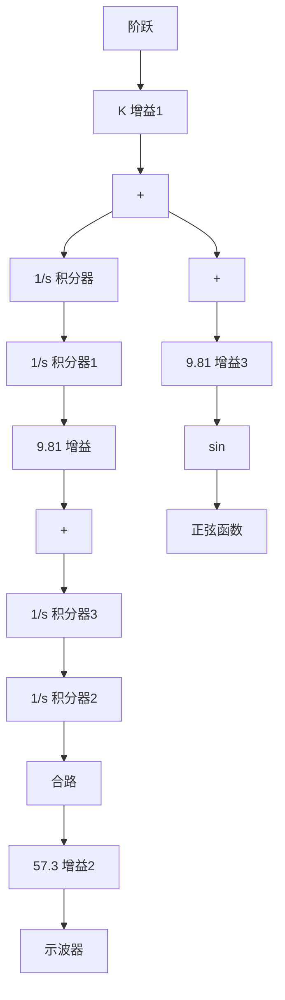

# 例2.6 使用Simulink解决非线性运动：摆

运用 Simulink 来分析例 2.5 中摆锤摆角 $\theta$ 随时间的变化情况。将 $T_{c}$ 值为 $1 ~N \cdot m$ 和 $4 ~N \cdot m$ 的线性化结果进行比较。

解答。时间关系曲线图：将上述讨论的这两种情况的 Simulink 框图结合起来，图 2.16 和图 2.17 所示的输出通过一个“多路器模块 (Mux)”接到“示波器”，因此它们可以在一张图上绘制出曲线。在图 2.18 所示系统中，结合后的框图中的增益 K 代表 $T_{c}$ 的值。在 $T_{c}$ 值为 $1N \cdot m$ 和 $4N \cdot m$ 情况下，系统输出如图 2.19 所示。注意 $T_{c} = 1N \cdot m$ 时，输出保持小于等于 $12^{\circ}$ ，且非线性输出与近似线性化的输出结果非常接近。当 $T_{c} = 4N \cdot m$ 时，输出角度接近 $50^{\circ}$ 。由于 $\theta$ 和 $\sin\theta$ 的近似处理，这时响应幅度及频率的巨大差异性就体现得很明显。事实上，相比 $\theta$ ， $\sin\theta$ 表示了弱化的重力恢复力，因此，我们可以看到随着 $\theta$ 加大，非线性响应的辐值增大，频率降低，与近似线性化的输出差异性增大。

flowchart

图 2.18 摆的线性模型和非线性模型的框图

line

