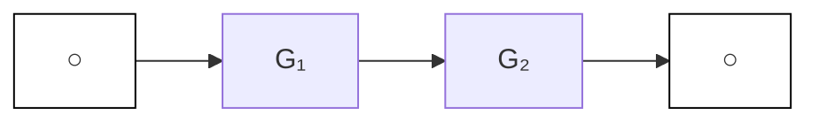
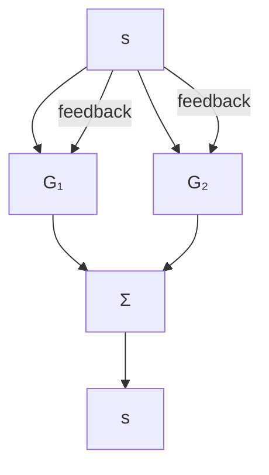
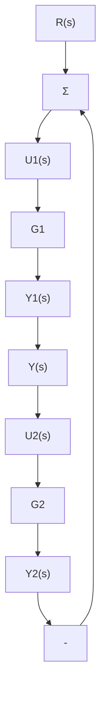

# 3.2.1 框图

为获取传递函数，我们需要求出运动方程的拉普拉斯变换，以及求解所得的代数方程，从而获得输入输出的关系。在许多控制系统中，系统方程可以写出来，而且只有某些环节的输入是另一个环节的输出时，它们各部分之间才有相互作用。在这些情况下，与第1章中图1.2所示的组成框图相类似，很容易就能绘制出描述数学关系的框图。将每一部分的传递函数放在一个方框内，两部分之间的输入输出关系用线和箭头表示。然后我们可以通过图形的化简来求解方程。尽管这种方法与代数方法是完全等价的，但它往往更简单且信息量更大。三种基本框图如图3.9所示，为方便起见，各个方框可视为内部标注了传递函数的电子放大器。方框的互连包括相加点，在这个点上任何数量的信号都可能被加到一起。这些点用一个内含 $\sum$ 符号的圆圈表示。在图3.9a中，带传递函数 $G_{1}(s)$ 的方框与带传递函数 $G_{2}(s)$ 的方框串联在一起，总传递函数是 $G_{1}$ 与 $G_{2}$ 的乘积 $G_{2}G_{1}$ 。在图3.9b中，两个系统并联，它们的输出相加，总传递函数是 $G_{1}$ 与 $G_{2}$ 的和 $G_{1} + G_{2}$ 。这些框图可以由描述它们的方程得出。

flowchart

$$\frac {Y _ {2} (s)}{U _ {1} (s)} = G _ {2} G _ {1}$$

a）串联

flowchart

$$\frac {Y (s)}{U (s)} = G _ {2} + G _ {1}$$

b）并联

flowchart

$$\frac {Y (s)}{R (s)} = \frac {G _ {1}}{1 + G _ {2} G _ {1}}$$

c）反馈

图3.9 基本框图的三个例子

图 3.9c 所示的为一个更复杂的情况。这里两个方框以反馈形式相连，以便互为输入。如图 3.9c 所示，当反馈 $Y_{2}(s)$ 被减去时，称之为负反馈。通常，系统的稳定性要求系统为负反馈。现在，我们求解这些方程，然后将它们与框图联系起来。这些方程为

$$U _ {1} (s) = R (s) - Y _ {2} (s)Y _ {2} (s) = G _ {2} (s) G _ {1} (s) U _ {1} (s)Y _ {1} (s) = G _ {1} (s) U _ {1} (s)$$

方程的解为

$$Y _ {1} (s) = \frac {G _ {1} (s)}{1 + G _ {1} (s) G _ {2} (s)} R (s) \tag {3.58}$$

我们可以通过以下规则来表示解。

单回路负反馈系统的增益由前向增益除以1与回路增益之和的商给出。

当反馈是加而不是减时，我们称它为正反馈。在这种情况下，其增益由前向增益除以1与回路增益之差给出。

图 3.9 给出的三种基本情况可以结合起来，通过重复化简去求解任意由框图定义的传递函数。然而，当拓扑图很复杂时，处理过程冗长乏味且容易出错。图 3.10 所示框图的代数关系的例子是对图 3.9 的补充。图 3.10a 和 b 所示的为框图之间的连接在不影响其数学关系的情况下是如何进行处理的。图 3.10c 所示的为如何处理可以使一个常规系统（左侧）变换成一个反馈路径上没有元件的系统，通常称为单位反馈系统。
