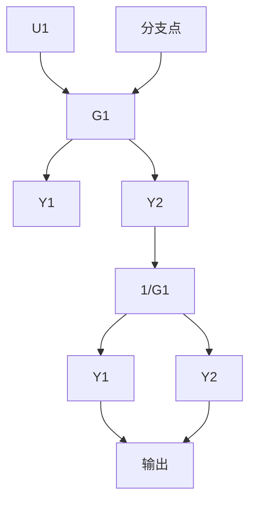
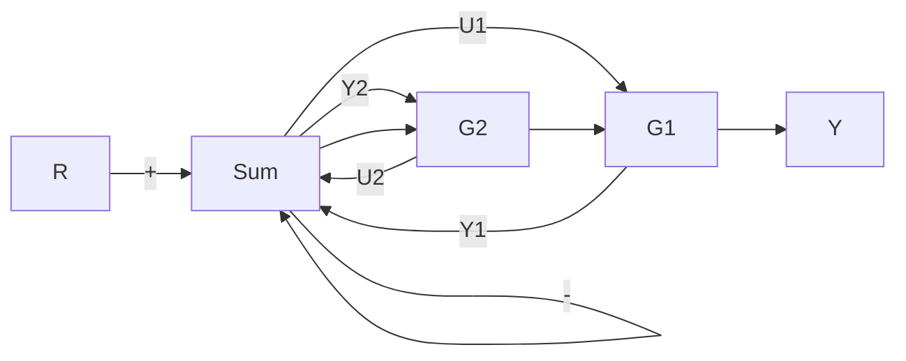

flowchart

```mermaid
graph TD
    A["U1"] --> B["G1"]
    C["分支点"] --> B
    B --> D["Y1"]
    B --> E["Y2"]
    E --> F["1/G1"]
    F --> G["Y1"]
    F --> H["Y2"]
    G --> I["输出"]
    H --> I
```

a）移动分支点

flowchart

```mermaid
graph LR
    A["U₁"] --> B["Σ"]
    B --> C["G₁"]
    C --> D["Y₁"]
    D --> E["Σ"]
    E --> F["Y₁"]
    F --> G["G₁"]
    G --> H["Σ"]
    H --> I["Y₁"]
    I --> J["G₁"]
    J --> K["Σ"]
    K --> L["Y₁"]
    L --> M["G₁"]
    M --> N["Σ"]
    N --> O["Y₁"]
    O --> P["G₁"]
    P --> Q["Σ"]
    Q --> R["Y₁"]
    R --> S["G₁"]
    S --> T["Σ"]
    T --> U["Y₁"]
    U --> V["G₁"]
    V --> W["Σ"]
    W --> X["Y₁"]
    X --> Y["G₁"]
    Y --> Z["Σ"]
    Z --> AA["Y₁"]
    AA --> AB["G₁"]
    AB --> AC["Σ"]
    AC --> AD["Y₁"]
    AD --> AE["G₁"]
    AE --> AF["Σ"]
    AF --> AG["Y₁"]
    AG --> AH["G₁"]
    AH --> AI["Σ"]
    AI --> AJ["Y₁"]
    AJ --> AK["G₁"]
    AK --> AL["Σ"]
    AL --> AM["Y₁"]
    AM --> AN["G₁"]
    AN --> AO["Σ"]
    AO --> AP["Y₁"]
    AP --> AQ["G₁"]
    AQ --> AR["Σ"]
    AR --> AS["Y₁"]
    AS --> AT["G₁"]
    AT --> AU["Σ"]
    AU --> AV["Y₁"]
    AV --> AW["G₁"]
    AW --> AX["Σ"]
    AX --> AY["Y₁"]
```

b）移动相加点

flowchart

```mermaid
graph LR
    R -->|+| Sum
    Sum -->|U1| G1
    G1 -->|Y1| Sum
    Sum -->|Y2| G2
    G2 -->|U2| Sum
    Sum -->|R| Sum
    Sum -->|-| Sum
    Sum --> G2
    G2 --> G1
    G1 --> O["Y"]
```

c）转换成单位反馈  
图 3.10 框图的代数关系的例子

在所有情况下，化简的基本原则是简化拓扑图的同时保持框图剩余变量之间的关系完全一致。对基本线性方程组的代数运算来说，框图简化是一种通过消除变量求解方程的图示方法。
