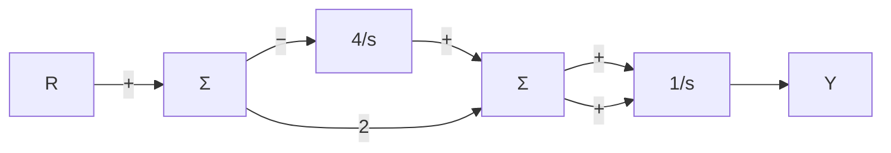
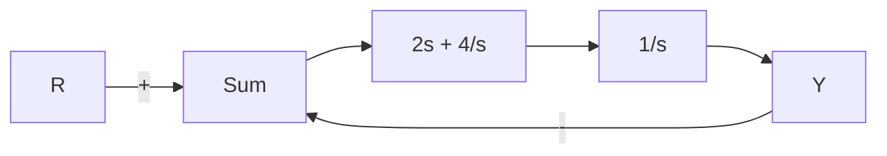

# 例3.22 由简单框图求传递函数

求解图 3.11a 所示系统的传递函数。

flowchart

a)

flowchart

b)   
图 3.11 二阶系统的框图

解答。首先我们通过减少控制器路径上的并联环节来简化框图。所得结果如图 3.11b 所示，并且使用反馈规则获取闭环传递函数为

$$T (s) = \frac {Y (s)}{R (s)} \frac {\frac {2 s + 4}{s ^ {2}}}{1 + \frac {2 s + 4}{s ^ {2}}} = \frac {2 s + 4}{s ^ {2} + 2 s + 4}$$
