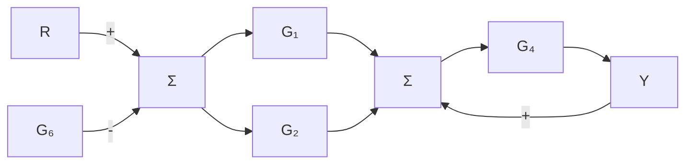

# 例3.24 用Matlab求简单系统的传递函数

使用 Matlab 重新计算图 3.11a 所示框图的传递函数。

解答。将图 3.11a 所示的每个方框内的传递函数表示成图 3.13 所示的形式。然后我们通过以下程序合并两个并联的方框：


<details>
<summary>flowchart</summary>


</details>

图 3.13 框图简化示例

```matlab
s=tf('s');    % specify a transfer function using a rational function in the Laplace variable s
sysG1=2;    % define subsystem G1
sysG2=4/s;    % define subsystem G2
sysG3=parallel(sysG1,sysG2);    % parallel combination of G1 and G2
sysG4=1/s;    % define subsystem G4
sysG5=series(sysG3,sysG4);    % series combination of G3 and G4
sysG6=1;
sysCL=feedback(sysG5,sysG6,-1);    % feedback combination of G5 and G6 
```

通过 Matlab 计算所得结果为 sysCL，表达形式为

$$\frac {Y (s)}{R (s)} = \frac {2 s + 4}{s ^ {2} + 2 s + 4}$$

这一结果与通过框图简化获得的结果相同。
