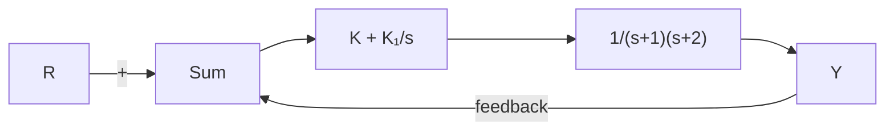

# 例3.34 相对于两个参数变化的稳定性

求控制器增益 $(K, K_{1})$ 的范围，以使图3.41所示的PI(比例积分，见第4章)反馈系统稳定。

flowchart

图 3.41 带比例积分(PI)控制器的系统

解答。闭环系统的特征方程为

$$1 + \left(K + \frac {K _ {1}}{s}\right) \frac {1}{(s + 1) (s + 2)} = 0$$

我们也可以写成如下形式：

$$s ^ {3} + 3 s ^ {2} + (2 + K) s + K _ {\mathrm{I}} = 0$$

对应的劳斯阵列为

$$
\begin{array}{l} s ^ {3}: \quad 1 \quad 2 + K \\ s ^ {2}: \quad 3 \quad K _ {I} \\ s: \quad (6 + 3 K - K _ {1}) / 3 \\ s ^ {0}: \quad K _ {1} \\ \end{array}
$$

为使内部稳定，必须有：

$$K _ {1} > 0, \quad K > \frac {1}{3} K _ {1} - 2$$

可以使用如下 Matlab 指令绘制允许的区域范围：

$$
\begin{array}{l} f h = @ (K I, K) 6 + 3 ^ {*} K - K I; \\ \text { ezplot } (f h) \\ \text { hold   on; } \\ f = @ (K I, K) K I; \\ \text { ezplot } (f); \\ \end{array}
$$

且该范围是图 3.42( $K_{1}$ ，K) 平面的阴影部分，它是稳定性问题的解析解。这个例子说明了劳斯判据方法的重要性，以及它比数字计算方法优越的原因。利用数位搜索方法会很难求得该增益的边界。该闭环传递函数为

$$T (s) = \frac {Y (s)}{R (s)} = \frac {K s + K _ {\mathrm{I}}}{s ^ {3} + 3 s ^ {2} + (2 + K) s + K _ {\mathrm{I}}}$$

如例 3.33 那样，使用 Matlab 函数计算分母多项式，进而求解不同动态补偿增益下的闭环极点。其语句如下。

$$\text { denT } = [ 1 3 2 + K K I ]; \quad \% \text { form denominator }$$

类似的，我们可以通过计算分子多项式的根来求解零点。其语句如下。

$$\text { numT } = [ \text { K KI } ]; \% \text { form numerator }$$

系统的闭环零点是 $-K_{1}/K$ 。图3.43所示的为三组反馈增益对应的暂态响应曲线。当K=1， $K_{1}=0$ 时，闭环极点位于0和 $-1.5\pm0.86j$ 处，并且在原点处有一个零点。当 $K=K_{1}=1$ 时，零极点都位于-1处。当K=10， $K_{1}=5$ 时，闭环极点位于-0.46和 $-1.26\pm3.3j$ 处，零点位于-0.5处。使用如下Matlab函数获取系统的阶跃响应：

text_image

K
0
-1
-2
6
K₁

图3.42 稳定的允许区域

line

| 时间/s | K = 10, K₁ = 5 | K = 1, K₁ = 1 | K = 1, K₁ = 0 |
| --- | --- | --- | --- |
| 0 | 0.0 | 0.0 | 0.0 |
| 1 | 1.2 | 0.2 | 0.1 |
| 2 | 0.9 | 0.6 | 0.3 |
| 3 | 1.0 | 0.8 | 0.35 |
| 4 | 1.0 | 0.9 | 0.35 |
| 5 | 1.0 | 0.95 | 0.35 |
| 6 | 1.0 | 0.98 | 0.35 |
| 7 | 1.0 | 0.99 | 0.35 |
| 8 | 1.0 | 0.995 | 0.35 |
| 9 | 1.0 | 0.998 | 0.35 |
| 10 | 1.0 | 1.0 | 0.35 |

图 3.43 图 3.41 所示系统的暂态响应

$$
\begin{array}{l l} \text {sysT = tf(numT,denT);} & \% \text {define system by its numerator and denominator} \\ \text {step(sysT)} & \% \text {compute step response} \end{array}
$$

在 $K_{I}=0$ 的情况下，存在一个较大的稳态误差（见第4章）。

如果某一行中第一个元素为零或者整行都为零，则标准的劳斯阵列就无法建立，所以我们只能使用下面的特殊方法来解决。
