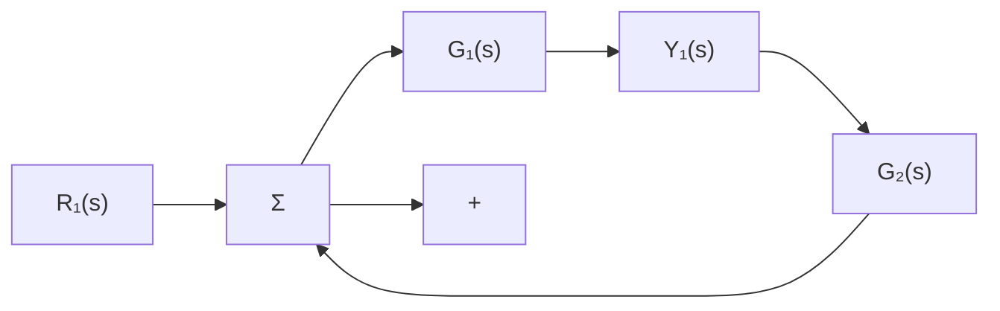

# 小结

\- 拉普拉斯变换是确定线性系统行为的主要方法。时间函数 $f(t)$ 的拉普拉斯变换为

$$\mathcal {L} [ f (t) ] = F (s) = \int_ {0 -} ^ {+ \infty} f (t) \mathrm{e} ^ {- s t} \mathrm{d} t \tag {3.91}$$

\- 这个关系式引出拉普拉斯变换的关键性质，即

$$\mathcal {L} [ \dot {f} (t) ] = s F (s) - f (0 ^ {-}) \tag {3.92}$$

\- 通过该性质我们可求解线性常微分方程的传递函数。给定系统的传递函数 $G(s)$ ，并且输入为 $u(t)$ ，其变换为 $U(s)$ ，那么系统输出的变换是 $Y(s) = G(s)U(s)$ 。

\- 通常，通过查表如附录 A 中的表 A.2 或通过计算机来求拉普拉斯反变换。拉普拉斯变换和它的反变换的性质在附录 A 中的表 A.1 中做了总结。

\- 在求稳定系统的稳态误差时，终值定理非常有用：若 $sY(s)$ 的所有极点位于左半平面，那么

$$\lim _ {t \to \infty} y (t) = \lim _ {s \to 0} s Y (s) \tag {3.93}$$

\- 框图是表示系统两部分之间关系的一种比较简便的方法。通常可利用图 3.10 和式(3.39)对框图进行简化，即框图与传递函数关系如下。

flowchart

