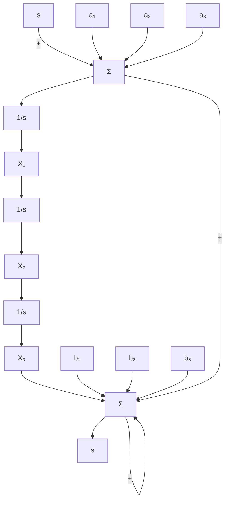
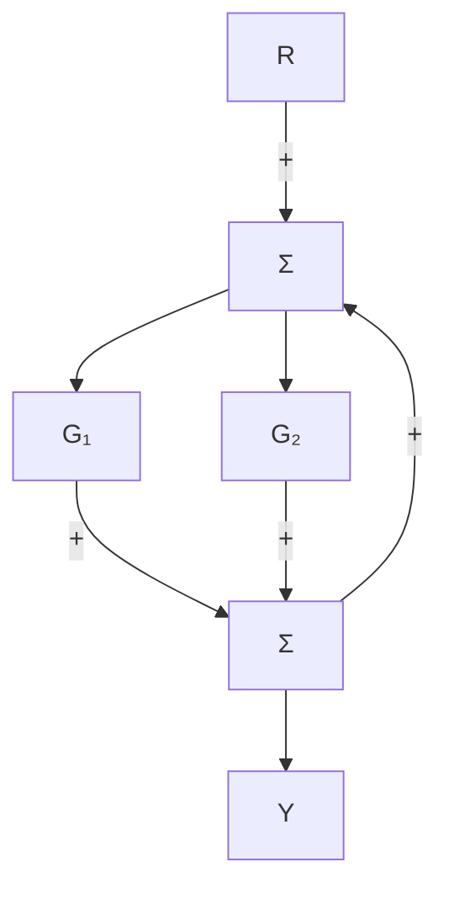
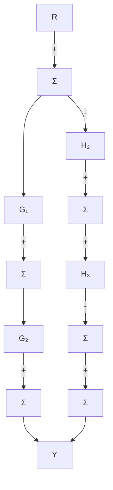

# 3.2节习题

3.19 考虑图 3.49 所示的框图。注意 $a_{i}$ 和 $b_{i}$ 是常数。计算该系统的传递函数。这种特殊结构称为“控制标准形”，将在第 7 章进一步讨论。  
3.20 计算图 3.50 所示框图的传递函数。


<details>
<summary>text_image</summary>

Fm
齿条和
小齿轮
1:N
变带比
Lₐ
Rₐ
+
iₒ(t)
vₐ(t)
vₛ(t)
-
重直可调辊
厚度T
厚度x
材料出辊运动
固定辊
</details>

图 3.48 连续辊轧机


<details>
<summary>flowchart</summary>


</details>

图3.49 习题3.19的框图


<details>
<summary>flowchart</summary>


</details>

图3.50 习题3.20的框图


<details>
<summary>flowchart</summary>

```mermaid
graph TD
    R0["R"] --> Sum1["Σ"]
    Sum1 --> G1["G₁"]
    G1 --> G3["G₃"]
    G3 --> Sum2["Σ"]
    Sum2 --> G4["G₄"]
    G4 --> G6["G₆"]
    G6 --> Sum3["Σ"]
    Sum3 --> Y["Y"]

subgraph b)
        G7["G₇"] --> Sum2
        G5["G₅"] --> Sum2
        Sum2 --> G4
        G3 --> Sum3
        G2 --> Sum3
        Sum3 --> G1
        G6 --> Sum3
    end

subgraph c)
        G7 --> Sum4["Σ"]
        G6 --> Sum4
        Sum4 --> G2["G₂"]
        G3 --> Sum5["Σ"]
        Sum5 --> G3["G₃"]
        G3 --> Sum6["Σ"]
        Sum6 --> G4["G₄"]
        G4 --> Sum7["Σ"]
        Sum7 --> G5["G₅"]
        G5 --> Sum8["Σ"]
        Sum8 --> Y["Y"]
    end
```
</details>

图 3.50 (续)

3.21 使用框图简化法求解图 3.51 所示框图的传递函数。图 3.51b 所示特殊结构称为 “观测标准形”，将在第 7 章进一步讨论。  
3.22 用框图代数变换式来确定图 3.52 中 $R(s)$ 和 $Y(s)$ 之间的传递函数。


<details>
<summary>flowchart</summary>


</details>

△3.23 用梅森公式求解图3.51所示框图的传递函数。
△3.24 用梅森公式确定图3.52中 $R(s)$ 和 $Y(s)$ 之间的传递函数。
