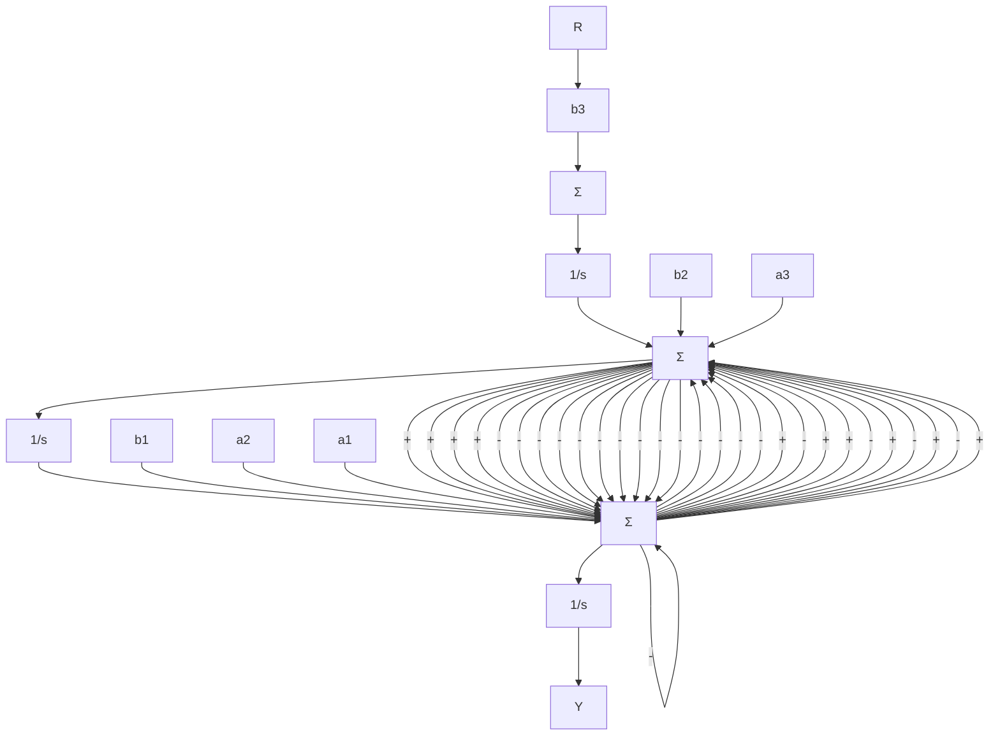
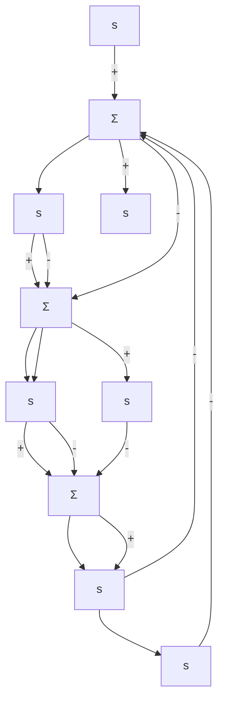
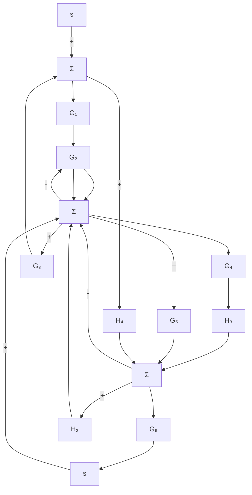

<details>
<summary>flowchart</summary>


</details>


<details>
<summary>flowchart</summary>

```mermaid
graph TD
    R --> b3
    b3 --> sum["Σ"]
    b2 --> sum
    b1 --> sum
    sum --> 1s1["1/s"]
    1s1 --> sum2["Σ"]
    a1 --> sum2
    a2 --> sum2
    a3 --> sum2
    sum2 --> 1s3["1/s"]
    1s3 --> sum3["Σ"]
    sum3 --> 1s4["1/s"]
    1s4 --> Y
    y --> c)
    a1 --> sum2
    a2 --> sum2
    a3 --> sum2
    sum2 --> 1s3
    sum2 --> 1s4
    sum2 --> 1s5["1/s"]
    1s5 --> sum3
    sum3 --> 1s6["1/s"]
    1s6 --> sum4
    sum4 --> 1s7["1/s"]
    1s7 --> sum5
    sum5 --> Y
    y --> c)
```
</details>


<details>
<summary>flowchart</summary>


</details>

图3.51 习题3.21的框图  


<details>
<summary>flowchart</summary>


</details>

图3.52 习题3.22的框图
