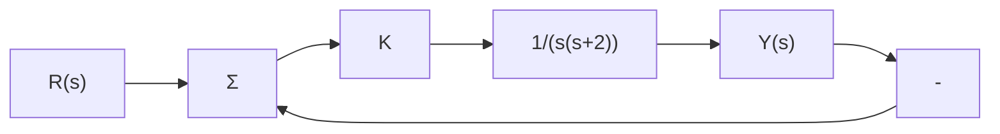
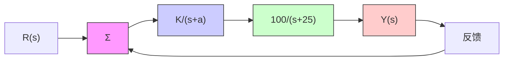

# 3.3节习题

3.25 对于图 3.53 所示的电路，求解下列问题：

chemical

Electrical circuit diagram with inductor, resistor, and capacitor components labeled L, R, C, and current i(t)

图 3.53 习题 3.25 的电路图

(a) 与 $i(t)$ 和 $v_{1}(t)$ 有关的时域方程；

(b) 与 $i(t)$ 和 $v_{2}(t)$ 有关的时域方程；

(c) 假设所有的初始条件为零，求系统的传递函数 $\frac{V_{2}(s)}{V_{1}(s)}$ 、阻尼比 $\zeta$ 和无阻尼自然频率 $\omega_{n}$ ;

(d) 设 $v_{1}(t)$ 为单位阶跃函数，L=10mH， $C=4\mu F$ ，求使 $v_{2}(t)$ 的超调不超过 25% 的 R 值。

3.26 对于图 3.54 所示的单位反馈系统，列举比例控制器的增益 K，以使系统在输入为单位阶跃时，输出 $y(t)$ 的超调不超过 10%。

flowchart

图 3.54 习题 3.26 的单位反馈系统

3.27 对于图 3.55 所示的单位反馈系统，列举补偿器的增益和极点位置，以使输入为单位阶跃时，所有闭环响应的超调不超过 25%，超调为 1% 时的调节时间不超过 0.1s。使用 Matlab 验证设计结果。

flowchart

图 3.55 习题 3.27 的单位反馈系统

3.4节

3.28 假设期望给定的二阶系统的峰值时间小于 $t_{p}^{\prime}$ 。在 s 平面上画出满足指标 $t_{p}<t_{p}^{\prime}$ 时，极值所对应的区域。

3.29 某伺服系统的动力学通过一对复极点和无有限零点控制。时域指标中的上升时间 $(t_{\mathrm{r}})$ ，超调 $(M_{\mathrm{p}})$ ，调节时间 $(t_{\mathrm{s}})$ 如下：

$$t _ {r} \leqslant 0.6 \mathrm{s}; \quad M _ {\mathrm{p}} \leqslant 17\%; \quad t _ {\mathrm{s}} \leqslant 9.2 \mathrm{s}.$$

(a) 在 s 平面内画出使系统满足以上三个条件的极点位置区域。

(b) 在绘制的图上标出具有最小上升时间同时也恰好满足调节时间的点(用记号

×表示）。

3.30 某反馈系统的响应指标如下：

- 超调 $M_{\mathrm{p}} \leqslant 16\%$   
● 调节时间 $t_{s} \leqslant 6.9s$ ;  
- 上升时间 $t_{\mathrm{r}} \leqslant 1.8 \mathrm{~s}$ 。

(a) 假设传递函数可以用一个简单的二阶模型近似，在 s 平面内画出合适的闭环极点的区域。

(b) 如果上升时间和调节时间完全符合指标要求，那么预期的超调是多少？

3.31 假设要设计一个如图 3.56 所示的一阶系统的单位反馈控制器。（正如将要在第 4 章学习的，图示构造是一个比例积分控制器。）设计的控制器要使闭环极点位于图 3.57 所示的阴影区域。
