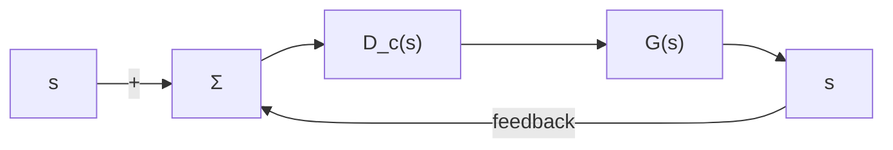

line

| t | y0 | y1 | y2 |
| --- | --- | --- | --- |
| 0 | y0 |  |  |
| τd |  |  |  |
| y1 |  | Δy1 |  |
| y2 |  |  | Δy2 |

图 3.62 对数衰减率定义

3.5节习题

3.38 在飞行器控制系统中，理想的俯仰响应 $(q_{0})$ 与俯仰指令 $(q_{c})$ 之间的传递函数描

述为

$$\frac {Q _ {\mathrm{o}} (s)}{Q _ {\mathrm{c}} (s)} = \frac {\tau \omega_ {\mathrm{n}} ^ {2} (s + 1 / \tau)}{s ^ {2} + 2 \zeta \omega_ {\mathrm{n}} s + \omega_ {\mathrm{n}} ^ {2}}$$

实际的飞行器的响应比这个理想的传递函数更为复杂；然而，这种理想的模型只可在自动驾驶仪的设计中起指导作用。假设 $t_{r}$ 为期望上升时间，那么，有

$$\omega_ {\mathrm{n}} = \frac {1 . 7 8 9}{t _ {\mathrm{r}}}\frac {1}{\tau} = \frac {1 . 6}{t _ {\mathrm{r}}}\zeta = 0. 8 9$$

通过绘制 $t_{r}=0.8s$ ，1.0s，1.2s，1.5s 时的阶跃响应，证明该理想响应具有较快的调节时间和最小超调。

3.39 将下面每一个传递函数近似为二阶传递函数。

$$G _ {1} (s) = \frac {(0 . 5 s + 1) (s + 1)}{(0 . 5 5 s + 1) (0 . 9 5 s + 1) (s ^ {2} + s + 1)}G _ {2} (s) = \frac {(0 . 5 s + 1) (s + 1)}{(0 . 5 5 s + 1) (0 . 9 5 s + 1) (s ^ {2} + 0 . 2 s + 1)}G _ {3} (s) = \frac {(- 0 . 5 s + 1) (s + 1)}{(0 . 9 5 s + 1) (0 . 0 5 s + 1) (s ^ {2} + s + 1)}G _ {4} (s) = \frac {(0 . 5 s + 1) (s + 1)}{(0 . 5 5 s + 1) (0 . 0 5 s + 1) (s ^ {2} + s + 1)}G _ {5} (s) = \frac {(0 . 5 s + 1) (0 . 0 2 s + 1)}{(0 . 5 5 s + 1) (0 . 9 5 s + 1) (s ^ {2} + s + 1)}$$

3.40 系统的闭环传递函数为

$$\frac {Y (s)}{R (s)} = T (s)= \frac {2 7 0 0 (s + 2 5)}{(s + 1) (s + 4 5) (s + 6 0) \left(s ^ {2} + 8 s + 2 5\right)}$$

flowchart

图 3.63 习题 3.41 的单位反馈系统

其中：R 是步长为 7 的阶跃函数。

(a) 给出一个各个响应和的输出时间关系曲线的表达式。

(b) 给出估计的阶跃响应的调节时间。

3.41 考虑图 3.63 所示的系统，其中，

$$G (s) = \frac {1}{s (s + 3)}, \quad D _ {c} (s) = \frac {K (s + z)}{s + p}$$

求 K、z 和 p 的值，使闭环系统在阶跃输入下的超调为 10%、调节时间为 1.5s（1% 判断标准）。

△3.42 绘制系统的阶跃响应，且系统的传递函数为

$$G (s) = \frac {s / 2 + 1}{(s / 4 0 + 1) [ (s / 4) ^ {2} + s / 4 + 1 ]}$$

根据极点和零点的位置验证你的答案。(不求拉普拉斯反变换)然后将你的答案与通过

Matlab 计算所得的阶跃响应做比较。

3.43 闭环传递函数为

$$H (s) =\frac {\left[ \left(\frac {s}{1 0}\right) ^ {2} + 0 . 1 \left(\frac {s}{1 0}\right) + 1 \right]}{\left[ \left(\frac {s}{4}\right) ^ {2} + \left(\frac {s}{4}\right) + 1 \right]}\times \frac {\left[ \frac {s}{2} + 1 \right] \left[ \frac {s}{0 . 1} + 1 \right]}{\left[ \left(\frac {s}{1 0}\right) ^ {2} + 0 . 0 9 \left(\frac {s}{1 0}\right) + 1 \right] \left[ \frac {s}{0 . 0 2} + 1 \right]}$$

估算该系统的超调 $M_{\mathrm{p}}$ 和暂态调节时间。

3.44 传递函数 $G(s)$ 为
