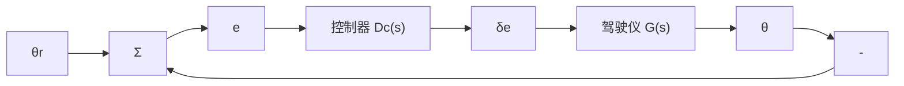

(a) 随 p 增大， $y(t)$ 中哪一项起主导作用？  
(b) 对于较小的 p 值，求 A 和 B 的估计值。  
(c) 随 p 增大，哪一项起主导作用？（变小就什么而言的？）  
(d) 设 $\omega_{n}=1$ 和 $\zeta=0.7$ ，使用上述的 $y(t)$ 的详细表达式或者是 Matlab 命令 step，画出当 p 的取值范围从非常小到非常大时上述系统的阶跃响应。在哪个点上附加极点对系统响应的影响将不再存在？

3.50 考虑如下具有附加零点的二阶单位直流增益的系统：

$$H (s) = \frac {\omega_ {\mathrm{n}} ^ {2} (s + z)}{z (s ^ {2} + 2 \zeta \omega_ {\mathrm{n}} s + \omega_ {\mathrm{n}} ^ {2})}$$

(a) 证明系统的单位阶跃响应为

$$y (t) = 1 - \frac {\sqrt {1 + \frac {\omega_ {\mathrm{n}} ^ {2}}{z ^ {2}} - \frac {2 \zeta \omega_ {\mathrm{n}}}{z}}}{\sqrt {1 - \zeta^ {2}}} \mathrm{e} ^ {- a t} \cos (\omega_ {\mathrm{d}} t + \beta_ {1})$$

其中：

$$\beta_ {1} = \arctan \frac {- \zeta + \frac {\omega_ {\mathrm{n}}}{z}}{\sqrt {1 - \zeta^ {2}}}$$

(b) 求出系统阶跃响应的超调 $M_{p}$ 的表达式。

(c) 给定超调 $M_{\mathrm{p}}$ 的值，如何求解 $\zeta$ 和 $\omega_{\mathrm{n}}$ ？

3.51 如图 3.64 所示的为自动驾驶仪设计的框图，用来保持飞行器的俯仰姿态角 $\theta$ 。升降角 $\delta_{e}$ 和俯仰姿态角 $\theta$ 相关的传递函数为

$$\frac {\Theta (s)}{\delta_ {e} (s)} = G (s) = \frac {5 0 (s + 1) (s + 2)}{(s ^ {2} + 5 s + 4 0) (s ^ {2} + 0 . 0 3 s + 0 . 0 6)}$$

其中 $\theta$ 在一定程度上为俯仰姿态角， $\delta_{e}$ 在一定程度上为升降角。自动驾驶仪控制者使用俯仰姿态角误差 e 根据以下传递函数调整飞机升降：

$$\frac {\delta_ {c} (s)}{E (s)} = D _ {c} (s) = \frac {K (s + 3)}{s + 1 0}$$

用 Matlab 求 K 的值，使单位阶跃变化时系统在 $\theta_{r}$ 处的超调小于 10%，上升时间比 0.5s 快。然后检查不同的 K 值时系统的阶跃响应，评价一下对复杂系统的上升时间和超调测量的难度。

flowchart

图3.64 习题3.51自动驾驶仪的框图
