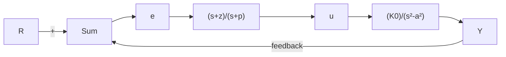

# 3.6节习题

3.52 在一个不稳定的飞行器的响应中，不稳定度的测量标准是在非零初始条件下，该飞行器的时间响应幅值达到稳定时的2倍时所需的时间（见图3.65）。


<details>
<summary>line</summary>

| 时间 | 幅值 |
| --- | --- |
| 起始点 | 0 |
| 足始点 | -A |
| 足始点 | 2A |
| 足始点 | τ₂ |
</details>

图3.65 双倍幅值的时间

(a) 对于一阶系统而言，证明时间的 2 倍为

$$\tau_ {2} = \frac {\ln 2}{p}$$

其中：p 为右半平面极点的位置。

(b) 对于一个二阶系统(右半平面有两个复极点)，证明：

$$\tau_ {2} = \frac {\ln 2}{- \zeta \omega_ {n}}$$

3.53 将单位反馈应用到下列开环系统中，使用劳斯稳定性判据确定所得的闭环系统是否稳定。

(a) $KG(s)=\frac{4(s+2)}{s(s^{3}+2s^{2}+3s+4)}$ ;

(b) $KG(s)=\frac{2(s+4)}{s^{2}(s+1)}$ ;

(c) $KG(s)=\frac{4(s^{3}+2s^{2}+s+1)}{s^{2}(s^{3}+2s^{2}-s-1)}$

3.54 用劳斯稳定性判据确定下述方程中有多少根具有正实部。

(a) $s^{4} + 8s^{3} + 32s^{2} + 80s + 100 = 0$ ;

(b) $s^{5}+10s^{4}+30s^{3}+80s^{2}+344s+480=0;$

(c) $s^{4} + 2s^{3} + 7s^{2} - 2s + 8 = 0$ ;

(d) $s^{3} + s^{2} + 20s + 78 = 0$ ;

(e) $s^{4} + 6s^{2} + 25 = 0$ 。

3.55 求 K 的取值范围，以使下述多项式的根都位于左半平面：

$$s ^ {5} + 5 s ^ {4} + 1 0 s ^ {3} + 1 0 s ^ {2} + 5 s + K = 0$$

通过在 s 平面内绘制不同 K 值时多项式的根，使用 Matlab 来验证所求答案。

3.56 一个典型的磁带驱动器系统的传递函数为

$$K G (s) = \frac {K (s + 4)}{s [ (s + 0 . 5) (s + 1) (s ^ {2} + 0 . 4 s + 4) ]}$$

其中时间的单位是 ms。使用劳斯稳定性判据确定 K 的取值范围，以使系统在特征方程 $1 + KG(s) = 0$ 时稳定。

3.57 考虑如图 3.66 所示的闭环磁悬浮系统。确定系统参数 $(a, K, z, p, K_{0})$ 的条件，以保证闭环系统的稳定性。


<details>
<summary>flowchart</summary>


</details>

图 3.66 习题 3.57 的磁悬浮系统

3.58 考虑如图 3.67 所示的系统。

(a) 计算闭环特征方程。

(b) $(T, A)$ 取何值时可使系统稳定？提示：使用

$$\mathrm{e} ^ {- T s} \approx 1 - T s$$

或

$$\mathrm{e} ^ {- T s} \approx \frac {1 - \frac {T}{2} s}{1 + \frac {T}{2} s}$$

作为纯延迟因素或许可以得到近似结果。作为一个选择方案，也可用计算机 Matlab (Simulink) 软件来对系统进行仿真，或者是求不同的 T 和 A 值时系统特征方程的根。


<details>
<summary>flowchart</summary>

```mermaid
graph LR
    R -->|+| Sum
    Sum --> e^(-sT)
    e^(-sT) --> A
    A --> Y
    Y -->|-| Sum
```
</details>

图3.67 习题3.58的控制系统

3.59 修正劳斯判据，使其能应用于所有极点位于 $-\alpha(\alpha>0)$ 左面的情况。将该修正后的判据应用到下述多项式中：

$$s ^ {3} + (6 + K) s ^ {2} + (5 + 6 K) s + 5 K = 0$$

求使多项式所有极点的实部均小于1时的K的值。

3.60 假设已知闭环系统的特征多项式为

$$
\begin{array}{l} s ^ {4} + (1 1 + K _ {2}) s ^ {3} + (1 2 1 + K _ {1}) s ^ {2} + \left(K _ {1} + K _ {1} K _ {2} \right. \\ + 1 1 0 K 2 + 2 1 0) s + 1 1 K _ {1} + 1 0 0 = 0 \\ \end{array}
$$
