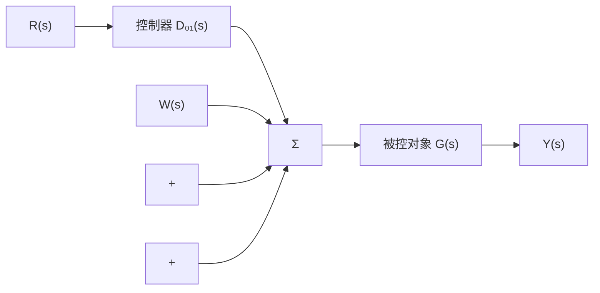
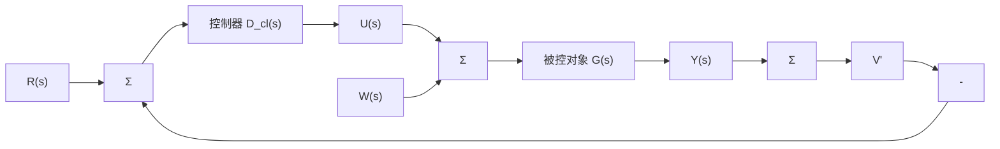

# 4.1 控制的基本方程

首先集中介绍在本书其余部分用到的一系列方程和传递函数。对于图4.1所示的开环

系统，如果在被控对象输入处有干扰作用，其输出则为

$$Y _ {\mathrm{ol}} = G D _ {\mathrm{ol}} R + G W \tag {4.1}$$

误差，即参考输入和系统输出间的差为

$$E _ {\mathrm{ol}} = R - Y _ {\mathrm{ol}} \tag {4.2}= R - \left[ G D _ {\mathrm{ol}} R + G W \right] \tag {4.3}= \left[ 1 - G D _ {\mathrm{ol}} \right] R - G W \tag {4.4}$$

此时，开环传递函数为

flowchart

图 4.1 参考输入为 R；控制为 U；干扰为 W；输出为 Y 的开环系统

$$T _ {\mathrm{ol}} (s) = G (s) D _ {\mathrm{ol}} (s)$$

对于反馈控制，图 4.2 给出了基本的单位反馈结构。具有三个外部输入：参考输入 R，系统输出要跟踪其轨迹；干扰输入 W，控制要将其抵消，使其不再影响系统输出；传感器噪声 V，控制器应忽略其影响。对于图 4.2 所示的反馈框图，其系统输出和控制方程分别由三个输入响应的方程叠加表示为

$$Y _ {\mathrm{cl}} = \frac {G D _ {\mathrm{cl}}}{1 + G D _ {\mathrm{cl}}} R + \frac {G}{1 + G D _ {\mathrm{cl}}} W - \frac {G D _ {\mathrm{cl}}}{1 + G D _ {\mathrm{cl}}} V \tag {4.5}U = \frac {D _ {\mathrm{cl}}}{1 + G D _ {\mathrm{cl}}} R - \frac {G D _ {\mathrm{cl}}}{1 + G D _ {\mathrm{cl}}} W - \frac {D _ {\mathrm{cl}}}{1 + G D _ {\mathrm{cl}}} V \tag {4.6}$$

flowchart

图 4.2 参考输入为 R；控制为 U；干扰为 W；输出为 Y；传感器噪声为 V 的闭环系统

182

或许比这些更重要的是误差方程，即

$$E _ {\mathrm{cl}} = R - Y _ {\mathrm{cl}}E _ {\mathrm{cl}} = R - \left[ \frac {G D _ {\mathrm{cl}}}{1 + G D _ {\mathrm{cl}}} R + \frac {G}{1 + G D _ {\mathrm{cl}}} W - \frac {G D _ {\mathrm{cl}}}{1 + G D _ {\mathrm{cl}}} V \right] \tag {4.7}= \frac {1}{1 + G D _ {\mathrm{cl}}} R - \frac {G}{1 + G D _ {\mathrm{cl}}} W + \frac {G D _ {\mathrm{cl}}}{1 + G D _ {\mathrm{cl}}} V \tag {4.8}$$

我们可以把式(4.5)，式(4.6)和式(4.8)改写为紧凑形式，即

$$Y _ {\mathrm{cl}} = \mathcal {T} R + G S W - \mathcal {T} V \tag {4.9}U = D _ {\mathrm{cl}} \mathcal {S} R - \mathcal {T} W - D _ {\mathrm{cl}} \mathcal {S} V \tag {4.10}E _ {\mathrm{cl}} = \mathcal {S} R - G \mathcal {S} W + \mathcal {T} V \tag {4.11}$$

其中：定义两个传递函数分别为

$$\mathcal {S} = \frac {1}{1 + G D _ {\mathrm{cl}}} \tag {4.12}$$

和

$$\mathcal {T} = \frac {G D _ {\mathrm{cl}}}{1 + G D _ {\mathrm{cl}}} \tag {4.13}$$

此时，闭环传递函数为

$$T _ {\mathrm{cl}} = \mathcal {T} = \frac {G D _ {\mathrm{cl}}}{1 + G D _ {\mathrm{cl}}}$$

这两个传递函数的重要性将在本节后面体现出来。运用这些方程，我们将探索开环、闭环情况下系统的四个基本控制目标：稳定性、跟踪、调节和灵敏度。
