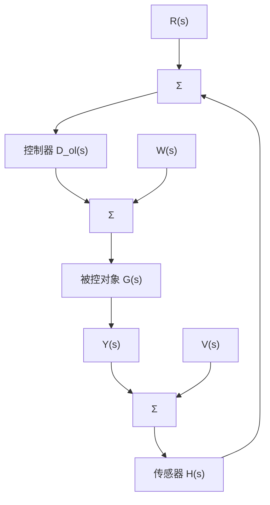

# 例 4.3 带转速计反馈的伺服系统的系统类型

考虑一个电动机位置控制问题，电动机轴上的测速计通过反馈测速计电压（正比于轴转速）构成一个非单位反馈系统，如图4.5所示，其参数为

$$G (s) = \frac {1}{s (\tau s + 1)}D _ {\mathrm{c}} (s) = k _ {\mathrm{p}}H (s) = 1 + k _ {\mathrm{t}} s$$

试确定系统类型及与参考输入相关的误差常数。

flowchart

图 4.5 参考输入为 R；控制输入为 U；输出为 Y；传感器噪声为 V 的具有传感器动态的闭环系统

解答。系统误差为

$$
\begin{array}{l} E (s) = R (s) - Y (s) \\ = R (s) - \mathcal {T} (s) R (s) \\ = R (s) - \frac {D _ {\mathrm{c}} (s) G (s)}{1 + H (s) D _ {\mathrm{c}} (s) G (s)} R (s) \\ = \frac {1 + (H (s) - 1) D _ {\mathrm{c}} (s) G (s)}{1 + H (s) D _ {\mathrm{c}} (s) G (s)} R (s) \\ \end{array}
$$

由式 $(4.45)$ 得出的系统稳态误差为

$$e _ {\mathrm{ss}} = \lim _ {s \to 0} s R (s) [ 1 - T (s) ]$$

对一个多项式参考输入 $R(s) = 1 / s^{k + 1}$ ，因此

$$
\begin{array}{l} e _ {\mathrm{ss}} = \lim _ {s \rightarrow 0} \frac {[ 1 - \mathcal {T} (s) ]}{s ^ {k}} = \lim _ {s \rightarrow 0} \frac {1}{s ^ {k}} \frac {s (\tau s + 1) + (1 + k _ {\mathrm{t}} s - 1) k _ {\mathrm{P}}}{s (\tau s + 1) + (1 + k _ {\mathrm{t}} s) k _ {\mathrm{P}}} \\ = \left\{ \begin{array}{l l} 0, & k = 0 \\ \frac {1 + k _ {\mathrm{t}} k _ {\mathrm{P}}}{k _ {\mathrm{P}}}, & k = 1 \end{array} \right. \\ \end{array}
$$

所以，系统为1型，速度常数是 $K_{v}=\frac{k_{P}}{1+k_{r}k_{P}}$ 。

注意若 $k_{t}>0$ ，为提高稳定性或动态响应，速度常数比单位反馈时的速度常数 $k_{p}$ 要小。结论是如果用转速计反馈来提升动态响应效果，稳态误差通常会增加，即在提高稳定性和减小稳态误差两方面进行折中。
